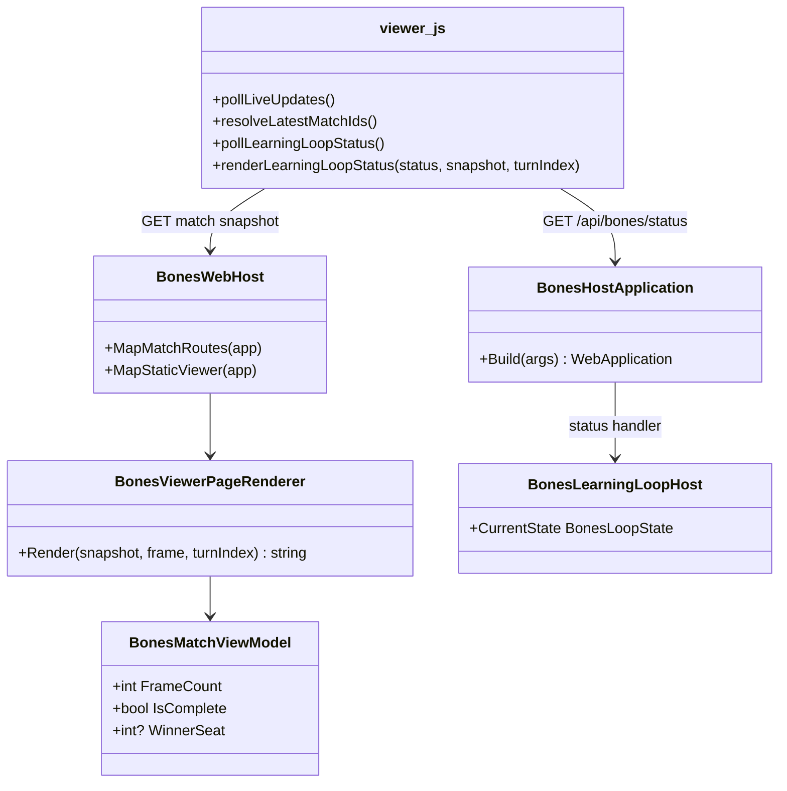

# WIP Bones Match Viewer Learning Loop Status Sidebar Requirements and Test Plan

> Scope: extend the `Wip.Bones.Web` match viewer sidebar so operators see live learning-loop diagnostics (iteration, stage, game budget, learning-player strategy/effectiveness, promotion outcome, last error, model provider) and current-match turn progress without leaving the viewer or polling APIs manually. Reuse existing `GET /api/bones/status` from `Wip.Bones.Host` when co-hosted; degrade gracefully when the status endpoint is absent.

---

## Functionality Worktree

### Verification Policy

- Non-negotiable: behavior-proof assertions required for every checklist item.
- Metadata-only assertions (DOM id presence, JSON key existence without displayed values) are supporting evidence only.
- Sidebar status tests must prove rendered text and `data-*` attributes match live status JSON and match snapshot semantics after poll/update — not merely that a fetch occurred.
- Host integration tests must open `/viewer/` while the learning loop advances and assert sidebar fields change coherently with `/api/bones/status` and match `frameCount`.
- API tests on the status route remain owned by `Wip.Bones.Host.Tests`; this document covers viewer consumption and DOM proof only.

### Coverage Inputs

| Input | Value |
|---|---|
| CsProject | Wip.Bones.Web (with Wip.Bones.Web.Tests and Wip.Bones.Host.Tests; status API owned by Wip.Bones.Host) |
| AnalysisSource | Caller request: surface learning-loop and match-progress information in the viewer sidebar. Today `viewer.js` polls `/api/bones/status` every 2s only to read `viewerUrl` (`resolveLatestMatchIds`); operators see no console progress during long DeepSeek ponder/play/enhance stages and must poll status manually. `BonesHostApplication` already exposes `isRunning`, `iterationCount`, `currentStage`, `gamesSimulated`, `maxGamesPerRun`, `capReached`, `learningPlayer`, `learningPlayerStatus`, `learningPlayerError`, `lastIterationError`, `lastPromotionOutcome`, `libraryEffectiveness`, and `modelProvider` on `GET /api/bones/status`. Sidebar already contains hands, active seat, scrubber, and turn output (`index.html:16-24`). |
| MandatoryItems | Learning-loop status panel in sidebar; periodic status poll and DOM update; match turn progress line tied to snapshot `frameCount`; graceful hide when status API unavailable; SSR/SPA structural parity; host live-loop integration proof; behavior-proof policy compliance |
| PlanType | requirements |
| OutputPath | harness/requirements/Wip.Bones.ViewerLearningLoopStatus.md |
| OutputTitle | WIP Bones Match Viewer Learning Loop Status Sidebar Requirements and Test Plan |

### Project Layout and Ownership

| Project | Role | Runtime proof gates |
|---|---|---|
| Wip.Bones.Web | `index.html`, `viewer.css`, `viewer.js`, `BonesViewerPageRenderer` | DOM displays status fields; poll updates text/data attributes; degrades on 404 |
| Wip.Bones.Host | `GET /api/bones/status` (existing) | Source of truth JSON for co-hosted viewer |
| Wip.Bones.Web.Tests | DOM + test-factory with stub status route | Trait-bound checklist compliance |
| Wip.Bones.Host.Tests | WebApplicationFactory while loop runs | Sidebar tracks live stage and turn growth |

### Sidebar Status Baseline (Caller Rules)

| Field group | Display | Source |
|---|---|---|
| Loop running | Running / stopped indicator | `isRunning`, `capReached` |
| Iteration | `Iteration N` | `iterationCount` |
| Stage | `Observe`, `Ponder`, `Play`, `Enhance`, `Complete`, `Failed`, `CapReached`, `Stopped`, or `Idle` | `currentStage`; show `failureStage` when `Failed` |
| Game budget | `gamesSimulated` / `maxGamesPerRun` (hide denominator when `maxGamesPerRun` is 0) | status JSON |
| Match turns | `Turn X of Y` for the active match (Y = snapshot `frameCount`; X = scrubber turn when not pinned to latest, else Y) | match snapshot + scrubber |
| Match complete | Winner seat and complete badge when snapshot `isComplete` | match snapshot |
| Learning player | Seat, `activeStrategyId`, optional `candidateStrategyId`, wins/losses/score differential | `learningPlayer` |
| Ponder pending | `Strategy pending` when `learningPlayerStatus === "pending"` | status JSON |
| Learning player error | Non-fatal read error message | `learningPlayerError` |
| Last iteration error | Message + stage when present | `lastIterationError` |
| Last promotion | `Promoted` or `Rejected` | `lastPromotionOutcome` |
| Library best | Top library strategy id + effectiveness summary (compact) | `libraryEffectiveness` |
| Model provider | `provider` + `model` only — never API key material | `modelProvider` |

### UI Placement and Behavior

| Rule | Behavior |
|---|---|
| Panel location | New `#learning-loop-status` section at the **top** of `.viewer-sidebar`, above `.hands` |
| Polling | Poll `/api/bones/status` on the existing `STATUS_POLL_INTERVAL_MS` cadence (2s), independent of match snapshot poll |
| Update contract | Each successful poll updates text nodes and `data-*` attributes on the panel; no full-page reload |
| Unavailable API | On 404/network error, add `hidden` class (or `aria-hidden`) and do not throw; match replay continues |
| Co-hosted default | When served from `Wip.Bones.Host`, panel is visible and populated after first successful poll |
| Standalone web | When status route absent, panel stays hidden — viewer remains usable for static replay |
| SSR/SPA parity | `BonesViewerPageRenderer` emits the same `#learning-loop-status` skeleton with neutral placeholder values |
| Styling | Compact monospace or small-caps labels; error states use distinct class; panel scrolls inside sidebar without displacing board |

### Defect Baseline (Caller-Reported + Code Audit)

| Symptom | Observed cause |
|---|---|
| Host appears stuck after viewer URL prints | Learning loop is silent on stdout; only `viewerUrl` is consumed from status poll (`viewer.js:436-451`) |
| Operator must run `Invoke-RestMethod /api/bones/status` manually | No viewer UI binds status fields |
| Turn count only on scrubber label | Scrubber shows turn index but not loop stage, iteration, or game budget |
| Status API already complete | `BonesHostApplication.cs:43-168` exposes all required fields |

### Class Diagram

### Completeness Checklist

- [x] Add `#learning-loop-status` section to `wwwroot/viewer/index.html` with semantic child elements and stable ids/`data-*` hooks for every field group in the Sidebar Status Baseline table [foundation for DOM binding]
- [x] Mirror the same `#learning-loop-status` skeleton in `BonesViewerPageRenderer` SSR output inside `.viewer-sidebar` [depends on HTML structure] [mandatory - SSR/SPA parity]
- [x] Add `viewer.css` rules for `.learning-loop-status`, label/value pairs, error/promotion emphasis, and hidden-unavailable state without breaking existing sidebar scroll layout [depends on HTML structure]
- [x] Implement `pollLearningLoopStatus` in `viewer.js`: fetch `/api/bones/status`, parse JSON, call renderer; swallow 404/network errors and hide panel [depends on HTML structure] [mandatory - status poll]
- [x] Implement `renderLearningLoopStatus(status, snapshot, turnIndex)` in `viewer.js`: map status JSON and active match snapshot to panel text and `data-*` attributes per Sidebar Status Baseline; format game budget with zero-max guard [depends on poll function] [mandatory - field binding]
- [x] Wire status poll into existing live update loop (`pollLiveUpdates` or parallel interval) without blocking match snapshot reload or scrubber frame loads [depends on poll function]
- [x] Update match turn line when snapshot `frameCount` or scrubber value changes so `Turn X of Y` stays coherent during live play and replay scrub [depends on render function] [mandatory - match turn progress]
- [x] Show `learningPlayerStatus: "pending"` and omit effectiveness block until `learningPlayer` is present; surface `learningPlayerError` and `lastIterationError` in distinct error styling [depends on render function] [mandatory - defensive display]
- [x] Never render secret values: omit `apiKeySource` value display beyond existing diagnostic label if shown; assert no API key patterns in DOM tests [depends on render function]
- [x] Add `Wip.Bones.Web.Tests` coverage: stub `/api/bones/status` on test factory; serve viewer; assert DOM `data-*` and text match stub JSON; assert panel hidden when status returns 404; assert turn line updates when snapshot `frameCount` increases [depends on all viewer changes] [mandatory - behavior proof]
- [x] Add `Wip.Bones.Host.Tests` coverage: open `/viewer/` while learning loop runs (stub providers); poll until `currentStage` advances; assert sidebar `data-current-stage` and iteration text track status API [depends on host + viewer wiring] [mandatory - host live-loop proof]
- [x] Register this requirements document in `BehaviorProofComplianceRegistry` with owning `Wip.Bones.Web.Tests` checklist bindings [depends on tests]
- [x] Enforce absolute behavior-proof verification for every planned integration test [mandatory - behavior-proof policy]

### Checklist to Runtime-Proof Matrix

| Checklist Item | Primary Runtime Proof Path | Minimum Evidence |
|---|---|---|
| Sidebar HTML skeleton | DOM query on `/viewer/index.html` and SSR `/view` | `#learning-loop-status` inside `.viewer-sidebar` with field hooks |
| CSS panel | Served CSS + DOM class assertions | `.learning-loop-status` present; error class on failed iteration fixture |
| Status poll | Test factory with stub status route + JS execution or Playwright | Panel populates after poll; hidden on 404 |
| Field binding | DOM text/`data-*` vs stub JSON | `iterationCount`, `currentStage`, budget, learning player, promotion, model |
| Live update wiring | Host factory during loop | Stage attribute changes when status stage changes |
| Match turn line | Snapshot fixture with increasing `frameCount` | `data-turn-index` / `data-frame-count` update |
| Pending/error display | Stub status with `learningPlayerStatus` / `lastIterationError` | Pending text shown; error message in error-styled node |
| No secret leakage | DOM string scan on rendered page | No `sk-` / bearer token patterns; provider shows model name only |
| Web.Tests compliance | Aggregated gate | Trait-filtered tests per checklist row |
| Host live-loop proof | BonesHostWebApplicationFactory | Sidebar tracks status while loop runs |
| Compliance registry | Registry test | Document listed with bindings |
| Behavior-proof policy | Plan self-check | Every item has executable tests |

---

## Falsify Claims

| # | Claim | Evidence | Status | Reason |
|---|---|---|---|---|
| 1 | Viewer already polls `/api/bones/status` on a timer | `viewer.js:50`, `viewer.js:436-451`, `viewer.js:560-574` | Supported | `STATUS_POLL_INTERVAL_MS = 2000`; used in `resolveLatestMatchIds` |
| 2 | Only `viewerUrl` is read from status JSON today | `viewer.js:443-448` | Supported | No other fields consumed |
| 3 | Status API exposes iteration, stage, budget, learning player, errors, promotion, model | `BonesHostApplication.cs:142-168` | Supported | Full JSON contract exists |
| 4 | Sidebar exists with hands and scrubber but no loop panel | `index.html:16-24` | Supported | No learning-loop section |
| 5 | Operators diagnose loop via README status polling | `Wip.Bones.Host/README.md:45-55`, `219-235` | Supported | External API poll documented |
| 6 | Match snapshot exposes `frameCount` and `isComplete` for turn progress | `BonesMatchViewerService.cs:75-79`; existing viewer scrubber | Supported | Already used for replay |
| 7 | Standalone `Wip.Bones.Web` may not map status route | `BonesWebHost.cs` maps match routes only; status on host | Supported | Graceful degradation required |
| 8 | Prior viewer requirements did not cover loop observability | `Wip.Bones.ViewerLayoutAndStability.md` sidebar rules list hands/scrubber only | Supported | Gap confirmed |
| 9 | DOM test infrastructure can assert sidebar panel content | `BonesViewerLayoutAndStabilityTests.cs` AngleSharp queries on `.viewer-sidebar` | Supported | Pattern exists |
| 10 | Host tests can open viewer during learning loop | `BonesViewerLayoutAndStabilityTests` host live-view pattern | Supported | Factory pattern exists |

Zero Falsified rows.

---

## Test Plan

### `viewer.js` — `pollLearningLoopStatus`

1. `BonesViewerLearningLoopStatus_GivenStatusEndpointReturnsJson_ExpectedPanelPopulatesDataAttributes`
   *Assumption*: A successful status fetch maps `iterationCount`, `currentStage`, and `gamesSimulated` onto `#learning-loop-status` `data-*` attributes.

2. `BonesViewerLearningLoopStatus_GivenStatusEndpointReturns404_ExpectedPanelHiddenAndNoUncaughtError`
   *Assumption*: Missing status route hides the panel and does not break match bootstrap or scrubber. [negative path]

3. `BonesViewerLearningLoopStatus_GivenStatusPollWhileScrubberActive_ExpectedMatchTurnLineUsesScrubberIndex`
   *Assumption*: When the user scrubs away from the latest turn, the turn line shows the scrubber index as X while Y remains snapshot `frameCount`.

### `viewer.js` — `renderLearningLoopStatus`

1. `BonesViewerLearningLoopStatus_GivenLearningPlayerPending_ExpectedPendingLabelWithoutEffectivenessBlock`
   *Assumption*: `learningPlayerStatus: "pending"` renders a pending label and omits wins/losses until `learningPlayer` exists.

2. `BonesViewerLearningLoopStatus_GivenLastIterationError_ExpectedErrorMessageAndStageInErrorStyledNode`
   *Assumption*: `lastIterationError.message` and `.stage` appear in the error-styled element with matching `data-failure-stage`.

3. `BonesViewerLearningLoopStatus_GivenLastPromotionRejected_ExpectedPromotionOutcomeDisplayed`
   *Assumption*: `lastPromotionOutcome: "Rejected"` renders visible rejected text in the promotion field.

4. `BonesViewerLearningLoopStatus_GivenModelProviderDeepSeek_ExpectedProviderAndModelWithoutSecretFields`
   *Assumption*: Panel shows provider and model names only; rendered HTML does not contain API key substrings.

5. `BonesViewerLearningLoopStatus_GivenMaxGamesPerRunZero_ExpectedBudgetShowsSimulatedCountOnly`
   *Assumption*: When `maxGamesPerRun` is 0, the budget line shows simulated count without `/0` denominator.

6. `BonesViewerLearningLoopStatus_GivenSnapshotFrameCountIncrease_ExpectedTurnOfYUpdates`
   *Assumption*: When live snapshot `frameCount` grows during play, the match turn line's Y value updates on the next render pass.

### `BonesViewerPageRenderer` / static HTML

1. `BonesViewerPage_GivenSnapshotRender_ExpectedLearningLoopStatusSkeletonInsideSidebar`
   *Assumption*: SSR `/view` HTML contains `#learning-loop-status` within `.viewer-sidebar` with placeholder neutral values.

2. `BonesViewerPage_GivenStaticSpaIndex_ExpectedLearningLoopStatusSkeletonMatchesSsrStructure`
   *Assumption*: `wwwroot/viewer/index.html` and SSR output share the same status panel child ids and `data-*` hook names.

### `BonesWebHost` + test factory (viewer consumption)

1. `BonesWebHost_GivenStubStatusRouteAndRegisteredMatch_ExpectedViewerSidebarReflectsStubStatusAfterLoad`
   *Assumption*: Test host mapping `/api/bones/status` plus a registered match serves viewer assets whose sidebar text matches the stub JSON after client bootstrap. [DI + HTTP path]

2. `BonesWebHost_GivenStubStatusStagePlay_ExpectedDataCurrentStageAttributeMatchesJson`
   *Assumption*: `data-current-stage` on the panel equals the stub `currentStage` value (`Play`).

### `Wip.Bones.Host` live integration

1. `BonesHostViewerLearningLoopStatus_GivenRunningLoop_ExpectedSidebarStageTracksStatusApi`
   *Assumption*: While the background loop runs with stub providers, opening `/viewer/` eventually shows a sidebar `data-current-stage` value that matches concurrent `GET /api/bones/status`. [host + viewer path]

2. `BonesHostViewerLearningLoopStatus_GivenLiveMatchPublish_ExpectedTurnOfYIncreasesWithFrameCount`
   *Assumption*: During play stage, sidebar match turn Y increases as catalog snapshot `frameCount` grows without a full page reload.

### Compliance registry

1. `BehaviorProofComplianceRegistry_GivenViewerLearningLoopStatusRequirements_ExpectedMapsChecklistRowsToWebTests`
   *Assumption*: Registry entry for this document binds each unchecked checklist row to at least one `[Trait("ChecklistItem", ...)]` test in `Wip.Bones.Web.Tests`.

### Absolute Behavior-Proof Compliance Gate

1. `BehaviorProofCompliance_GivenViewerLearningLoopStatusRequirements_RequiresExecutableRuntimeProofForEachItem`
   *Assumption*: Canonical compliance test executes Trait-bound tests for every checklist row.

2. `BehaviorProofCompliance_GivenMetadataOnlyAssertions_RejectsPlanAsNonCompliant`
   *Assumption*: DOM id-only or JSON key-only assertions without value semantics are rejected as sole evidence.

---

*All assumptions verified by Falsify Claims. Zero Falsified rows.*
