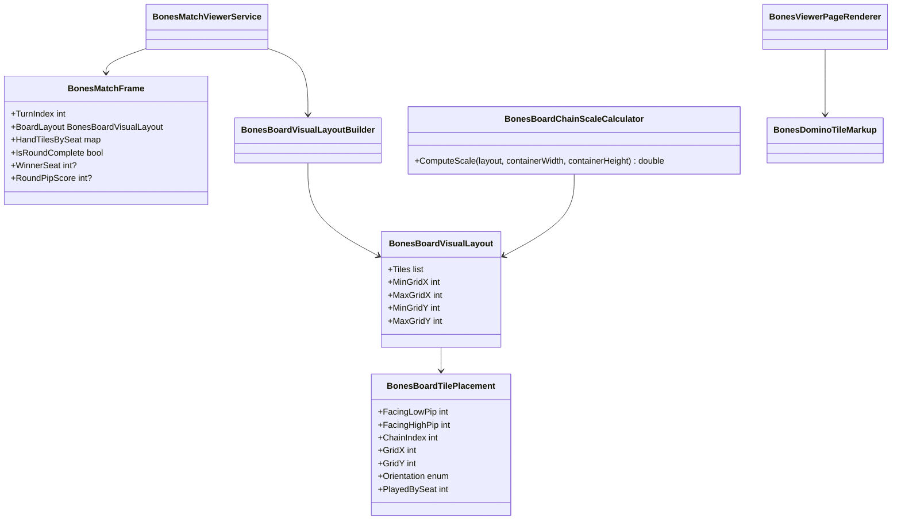

# WIP Bones Match Viewer Replay Reset and Board Scaling Requirements and Test Plan

> Scope: fix `Wip.Bones.Web` match viewer replay, board chain connectivity, and tile styling so scrubbing the turn slider fully resets board chain, open ends, hands, and round-completion chrome to the engine-equivalent state at the selected turn; domino tiles connect edge-to-edge with matching pips on touching faces (derived from engine-oriented `BonesBoard.Tiles`, not raw play-event tiles); the chain scales down to fit the board container; and tiles use a standard domino look (caller reference: centered seat-color disc on the divider, or seat color on the divider line when the disc complicates layout).

---

## Functionality Worktree

### Verification Policy

- Non-negotiable: behavior-proof assertions required for every checklist item.
- Metadata-only assertions are supporting evidence only.
- Replay tests must prove board tile identity (pip pairs and count), hand tile identity, and open-end pips at a mid-match turn differ from the final snapshot — not scrubber `data-turn-index` alone.
- Scaling tests must prove the board chain bounding box fits within the board container at maximum tile count for a seeded long-chain match (computed layout metrics or DOM geometry), not CSS class presence alone.
- API tests must prove frame JSON at turn *N* includes per-turn completion fields so the SPA can hide winner chrome before round end.

### Coverage Inputs

| Input | Value |
|---|---|
| CsProject | Wip.Bones.Web (with Wip.Bones.Web.Tests; builds on `Wip.Bones.ViewerVisualization.md`) |
| AnalysisSource | Caller request: replay knob must reset the board to the selected turn; domino pieces must scale down to fit the screen; board tiles show correct pip identity but connect on wrong faces with visible gaps; tile chrome should match standard domino presentation (reference cross-chain layout with colored center or colored divider) |
| MandatoryItems | Replay scrub resets board, hands, ends, and completion chrome to selected turn; engine-oriented chain connectivity (matching pips on touching edges); grid-based board chain using `GridX`/`GridY`; container-fit scaling for long chains; standard tile styling with seat color on center disc or divider line; behavior-proof policy compliance |
| PlanType | requirements |
| OutputPath | harness/requirements/Wip.Bones.ViewerReplayScaling.md |
| OutputTitle | WIP Bones Match Viewer Replay Reset and Board Scaling Requirements and Test Plan |

### Project Layout and Ownership

| Project | Role | Runtime proof gates |
|---|---|---|
| Wip.Bones.Web | `BonesBoardVisualLayoutBuilder`, `BonesMatchFrame`, `BonesViewerPageRenderer`, `viewer.js`, `viewer.css` | Frame JSON and DOM at turn *N* match engine replay; board fits container |
| Wip.Bones.Web.Tests | Unit, API, DOM, and layout-metric tests | Trait-bound checklist compliance |
| Wip.Bones (existing) | Engine replay source of truth | Unchanged |

### Defect Baseline (Caller-Reported)

| Symptom | Observed cause |
|---|---|
| Replay knob does not "reset" the board | SPA `renderFrame` updates chain and hands but leaves winner/round-score visible from initial `renderSnapshot` when match is complete; SSR always renders winner from `snapshot.IsComplete` regardless of `turnIndex` |
| Chain layout looks strange during replay | `#board-chain` uses `display:flex` with `flex-wrap:wrap` and sorts tiles by `gridX` only — `gridY` branch offsets are ignored, so doubles and branches wrap into a second row instead of a spatial chain |
| Pieces do not scale to fit | Tile size is fixed at `2.5rem`; no transform or cell-size reduction based on chain width/height vs `.board` container |
| Tiles connect on wrong faces / visible gaps | `BuildLayout` reads `playEvent.Tile` (hand tile) instead of engine-oriented `board.Tiles[i]`; `#board-chain` uses `gap: 0.25rem` flex without shared grid edges; orientation rules (opening vertical, double vertical + `gridY`) do not rotate halves so the matching pip faces the neighbor |
| Tile chrome not standard | White tiles with small pip dots and overlay circle differ from caller reference (larger pip readout, flush edge contact, seat color on divider or center disc) |

### Chain Connectivity Baseline (Caller Rules)

| Rule | Behavior |
|---|---|
| Source of truth | Each placement's displayed low/high pips and facing come from `BonesBoard.Tiles` chain order after engine `OrientTileForEnd`, paired with play events only for `PlayedBySeat` |
| Touching edges | Adjacent tiles share a grid edge with **no visible gap**; the pip on each touching face equals the neighbor's connecting pip |
| Main line | Non-double tiles on the primary chain axis render horizontal; opening tile at center is perpendicular (vertical) to the main line |
| Doubles | Double tiles render perpendicular to the chain segment they extend; both halves show the same pip; branch grid offsets (`gridY`) position the double so the main line continues through the open ends |
| Open ends | Left/right board-end indicators must match the outward-facing pip on the leftmost and rightmost chain tiles |
| Seat color | Prefer a filled disc centered on the divider (caller reference); if disc + layout conflict, render seat color on the divider line instead (`.domino-divider[data-seat-color]`) — same token in both modes |

### Completeness Checklist

- [x] Refactor `BonesBoardVisualLayoutBuilder` to zip `board.Tiles` (engine-oriented chain order) with play events for attribution; emit `FacingLowPip`/`FacingHighPip` (or equivalent flip flag) so each tile's rendered halves match the pip on the face that touches the previous/next neighbor [foundation for correct connectivity] [mandatory - engine-oriented chain connectivity]
- [x] Add layout validation in builder/tests: for every adjacent pair in chain order, the touching faces' pips are equal (invariant enforced by `BonesGameEngine.OrientTileForEnd`) [depends on oriented board tiles] [mandatory - connection invariant]
- [x] Extend `BonesBoardVisualLayout` with chain extent metadata (`MinGridX`, `MaxGridX`, `MinGridY`, `MaxGridY`, `ColumnCount`, `RowCount`) computed by `BonesBoardVisualLayoutBuilder` so clients can position and scale without re-deriving bounds [depends on connectivity refactor]
- [x] Extend `BonesMatchFrame` with `IsRoundComplete`, `WinnerSeat`, and `RoundPipScore` derived from `BonesRoundState.Outcome` at frame time; populate in `BonesMatchViewerService.CreateFrame` [depends on layout metadata] [mandatory - per-turn completion state for replay chrome]
- [x] Expose new frame fields on `GET /bones/sessions/{sessionId}/matches/{matchId}/frames/{turnIndex}` JSON (camelCase) without breaking existing consumers [depends on extended frame model]
- [x] Replace flex-wrap `#board-chain` layout with CSS grid (or absolute grid-cell placement) that positions each `.domino-tile` using `data-grid-x` and `data-grid-y` (and orientation) from `BonesBoardTilePlacement` — honoring `gridY` branch offsets for doubles; remove inter-tile gaps so shared edges abut (`gap: 0`, overlapping border, or single shared divider) [depends on layout metadata] [mandatory - spatial chain layout]
- [x] Restyle `.domino-tile` to standard domino chrome per caller reference: legible pip halves, flush rectangular tile, seat color as centered `.seat-color-marker` disc **or** colored `.domino-divider` when disc conflicts with grid overlap — controlled by one markup path in `BonesDominoTileMarkup` and `viewer.js` [depends on grid layout] [mandatory - standard tile styling]
- [x] Implement `BonesBoardChainScaleCalculator` (server) and mirror logic in `viewer.js` to compute a scale factor from layout extent vs board container size; apply via CSS custom property `--board-chain-scale` on `#board-chain` or an inner wrapper so the full chain fits without wrapping [depends on grid layout] [mandatory - scale to fit screen]
- [x] Update `BonesDominoTileMarkup` and `BonesViewerPageRenderer` SSR output to emit grid-positioned board tiles with extent/scale data attributes matching the SPA [depends on grid layout and scale calculator]
- [x] Update `viewer.js` `renderBoardChain` to clear and rebuild from frame `boardLayout` at each scrub, position tiles on the grid, recalculate scale after render (including `resize` listener), and call a shared `renderFrameChrome` that updates winner/round-score visibility from frame `isRoundComplete` (hide when false) [depends on frame completion fields and grid layout] [mandatory - replay scrub resets board and chrome]
- [x] Update `BonesViewerPageRenderer` to render winner and round pip score only when the selected frame is round-complete (or snapshot at final turn), not when `snapshot.IsComplete` alone is true at an earlier `turnIndex` [depends on frame completion fields] [mandatory - SSR replay reset]
- [x] Add `Wip.Bones.Web.Tests` coverage: layout extent metadata, frame completion fields, API JSON at mid-turn vs final turn, DOM tile pip parity and hand tile parity on scrub, grid position attributes, scale factor below 1 for long chains, and winner hidden at mid-turn on completed matches [depends on all above] [mandatory - behavior proof]
- [x] Register this requirements document in `BehaviorProofComplianceRegistry` with owning `Wip.Bones.Web.Tests` checklist bindings [depends on tests]
- [x] Enforce absolute behavior-proof verification for every planned integration test [mandatory - behavior-proof policy]

### Class Diagram

### Checklist to Runtime-Proof Matrix

| Checklist Item | Primary Runtime Proof Path | Minimum Evidence |
|---|---|---|
| Engine-oriented connectivity | `BonesBoardVisualLayoutBuilder` unit tests with replayed engine board | Adjacent placement facing pips match; uses `board.Tiles` not event tile |
| Connection invariant | Builder unit tests on left/right prepend/append sequences | Every chain-adjacent pair has equal connecting pip on shared face |
| Layout extent metadata | `BonesBoardVisualLayoutBuilder` unit tests | Min/max grid bounds match seeded play sequences |
| Standard tile styling | DOM on `/view` | Divider or center disc carries seat color; pip halves match facing attributes |
| Edge-abut layout | DOM/CSS metric | No flex gap between neighbors; grid cells share boundary |
| Frame completion fields | `CreateFrame` unit tests | Mid-turn frame has `IsRoundComplete=false`; final play frame has winner and pip score |
| JSON frame routes | WebApplicationFactory GET | Mid-turn response lacks winner fields or has `isRoundComplete: false`; final frame has completion fields |
| CSS grid chain | DOM on `/view?turnIndex=N` | Each tile has `data-grid-x`/`data-grid-y`; no flex-wrap row break for branch doubles |
| Scale calculator | Unit + DOM/layout metric | Scale < 1 when column count exceeds fit threshold; chain bounding box within container |
| SSR renderer | `/view?turnIndex=0` on completed match | `#winner` hidden or `hidden` class when round not complete at turn 0 |
| SPA replay scrub | Script content + integration DOM | `renderFrame` updates winner visibility; board tile pips match frame API |
| Compliance registry | Aggregated gate | Document listed; checklist rows map to trait-filtered tests |
| Behavior-proof policy | Plan self-check | Every item has executable tests; no metadata-only sole evidence |

---

## Falsify Claims

| # | Claim | Evidence | Status | Reason |
|---|---|---|---|---|
| 1 | SPA `renderFrame` does not update winner/round-score when scrubbing | `WIP/Wip.Bones.Web/wwwroot/viewer/viewer.js:213-249` — `renderFrame` never references `#winner` or `#round-score` | Supported | Completion chrome set only in `renderSnapshot` (lines 199-210) |
| 2 | SSR shows winner whenever `snapshot.IsComplete` regardless of scrubbed turn | `WIP/Wip.Bones.Web/Viewer/BonesViewerPageRenderer.cs:91-95` | Supported | Condition uses `snapshot.IsComplete`, not frame round outcome |
| 3 | Board chain ignores `gridY` and uses flex-wrap | `viewer.js:125-127` sorts by `gridX` only; `viewer.css:49-57` `display:flex; flex-wrap:wrap` | Supported | Branch offsets from layout builder are not applied visually |
| 4 | Tile size is fixed with no container scaling | `viewer.css:68-76` fixed `2.5rem` width/height | Supported | No `--board-chain-scale` or responsive cell sizing |
| 5 | Existing scrub DOM test asserts tile count only, not pip/hand parity | `WIP/Wip.Bones.Web.Tests/Viewer/BonesViewerVisualizationTests.cs:419-420` | Supported | `Assert.Equal(targetFrame.BoardLayout.Tiles.Count, boardTiles.Length)` only |
| 6 | `BonesMatchFrame` lacks per-turn completion fields today | `WIP/Wip.Bones.Web/Viewer/BonesMatchViewModels.cs:36-61` | Supported | No `IsRoundComplete`, `WinnerSeat`, or `RoundPipScore` on frame |
| 7 | Frame API and timeline already carry correct partial board/hand state per turn | `BonesMatchViewerService.CreateFrame` replays to event and builds layout from `state.EventLog` plays | Supported | Data layer is correct; defects are presentation and chrome sync |
| 8 | `BonesBoardVisualLayoutBuilder` assigns non-zero `gridY` for doubles after opening | `WIP/Wip.Bones.Web/Viewer/BonesBoardVisualLayoutBuilder.cs:40-46` | Supported | Doubles on left/right get `gridY = 1` |
| 9 | Layout builder uses play-event tiles, not engine-oriented board tiles | `BonesBoardVisualLayoutBuilder.cs:26` — `playEvent.Tile!.Value` while `BuildLayout` receives oriented `board.Tiles` | Supported | Hand tile orientation can differ from chain orientation after `OrientTileForEnd` |
| 10 | Engine orients tiles so connecting pips match on append/prepend | `BonesGameEngine.cs:206-228` — `OrientTileForEnd` flips low/high before storing on board | Supported | Board tile order is authoritative for which pip faces each neighbor |
| 11 | Board chain CSS inserts visible gap between tiles | `viewer.css:53` — `gap: 0.25rem` on `.board-chain` | Supported | Prevents flush edge-to-edge domino connection |
| 12 | Seat color is only a center overlay circle today | `viewer.css:124-135`, `viewer.js:76-81` — `.seat-color-marker` absolutely positioned | Supported | No divider-line fallback; disc may conflict with tight grid overlap |

Zero Falsified rows.

---

## Test Plan

### `BonesBoardVisualLayoutBuilder` (chain connectivity)

1. `BonesBoardVisualLayoutBuilder_GivenEngineReplayedBoard_ExpectedPlacementsUseBoardTilesNotEventTiles`
   *Assumption*: When a play event tile differs in orientation from the corresponding `board.Tiles[i]`, placement pips match the board tile.

2. `BonesBoardVisualLayoutBuilder_GivenLeftExtension_ExpectedTouchingPipsMatchBetweenNeighbors`
3. `BonesBoardVisualLayoutBuilder_GivenRightExtension_ExpectedTouchingPipsMatchBetweenNeighbors`
4. `BonesBoardVisualLayoutBuilder_GivenOpeningThenDouble_ExpectedDoublePerpendicularWithMatchingConnection`
5. `BonesBoardVisualLayoutBuilder_GivenFullChain_ExpectedChainIndexMatchesBoardTileOrder`

### `BonesBoardVisualLayout` (extent metadata)

1. `BonesBoardVisualLayoutBuilder_GivenMultiTileChain_ExpectedExtentMetadataMatchesGridBounds`
2. `BonesBoardVisualLayoutBuilder_GivenDoubleBranch_ExpectedNonZeroGridYReflectedInRowCount`

### `BonesMatchViewerService` (frame completion fields)

1. `BonesMatchViewerService_GivenMidTurnFrame_ExpectedIsRoundCompleteFalseAndNoWinner`
2. `BonesMatchViewerService_GivenFinalTurnFrame_ExpectedIsRoundCompleteTrueWithWinnerAndPipScore`
3. `BonesMatchViewerService_GivenMidTurnFrame_ExpectedBoardLayoutTileCountLessThanFinalSnapshot`

### `BonesBoardChainScaleCalculator`

1. `BonesBoardChainScaleCalculator_GivenNarrowContainer_ExpectedScaleBelowOneForLongChain`
2. `BonesBoardChainScaleCalculator_GivenShortChain_ExpectedScaleOne`
3. `BonesBoardChainScaleCalculator_GivenContainerResize_ExpectedScaleIncreasesWhenContainerWidens`

### `BonesWebHost` JSON API (replay fields)

1. `BonesWebHost_GivenMidTurnFrameRequest_ExpectedIsRoundCompleteFalseInJson`
2. `BonesWebHost_GivenFinalFrameRequest_ExpectedCompletionFieldsMatchEngine`
3. `BonesWebHost_GivenMidTurnFrameRequest_ExpectedBoardLayoutExtentMetadataPresent`

### `BonesViewerPageRenderer` / DOM (replay reset)

1. `BonesViewerPage_GivenCompletedMatchMidTurn_ExpectedWinnerHiddenAtEarlyTurnIndex`
2. `BonesViewerPage_GivenReplayScrubTurnIndex_ExpectedBoardTilePipsMatchFrameAtTurn`
3. `BonesViewerPage_GivenReplayScrubTurnIndex_ExpectedHandTilesMatchFrameAtTurn`
4. `BonesViewerPage_GivenReplayScrubTurnIndex_ExpectedOpenEndsMatchFrame`
5. `BonesViewerPage_GivenLongChain_ExpectedBoardChainScaleAttributeBelowOne`

### `BonesViewerPageRenderer` / DOM (grid layout)

1. `BonesViewerPage_GivenBoardChain_ExpectedTilesHaveGridPositionAttributes`
2. `BonesViewerPage_GivenDoubleWithBranchOffset_ExpectedDistinctGridYInDom`
3. `BonesViewerPage_GivenAdjacentBoardTiles_ExpectedConnectingPipAttributesMatch`
4. `BonesViewerPage_GivenBoardChain_ExpectedNoGapBetweenAdjacentTileElements`

### `BonesDominoTileMarkup` / tile styling

1. `BonesViewerPage_GivenBoardTile_ExpectedSeatColorOnDividerOrCenterDisc`
2. `BonesViewerPage_GivenBoardTile_ExpectedFacingPipsMatchDataAttributes`
3. `BonesViewerScript_GivenRenderBoardTile_ExpectedDividerFallbackWhenConfigured`

### Static SPA (`viewer.js`)

1. `BonesViewerScript_GivenRenderFrame_ExpectedUpdatesWinnerVisibilityFromFrameCompletion`
2. `BonesViewerScript_GivenRenderBoardChain_ExpectedAppliesGridPlacementAndScale`

### Compliance registry

1. `BehaviorProofComplianceRegistry_GivenViewerReplayScalingRequirements_ExpectedMapsChecklistRowsToWebTests`

### Absolute Behavior-Proof Compliance Gate

1. `BehaviorProofCompliance_GivenViewerReplayScalingRequirements_RequiresExecutableRuntimeProofForEachItem`
2. `BehaviorProofCompliance_GivenMetadataOnlyAssertions_RejectsPlanAsNonCompliant`

---

*All assumptions verified by Falsify Claims. Zero Falsified rows.*
