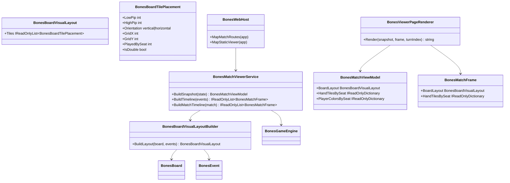

# WIP Bones Match Viewer Visualization Requirements and Test Plan

> Scope: enhance the `Wip.Bones.Web` match viewer so it renders actual domino tiles (not pip-end summaries and tile counts alone): each of four players has a stable seat color shown as a circle at the center of their tiles; the board displays the concatenated tile chain with the opening tile vertical at center, subsequent non-double tiles horizontal along the chain, and doubles vertical to expose branch/ramification points — all synchronized to engine replay state and the existing turn scrubber.

---

## Functionality Worktree

### Verification Policy

- Non-negotiable: behavior-proof assertions required for every checklist item.
- Metadata-only assertions are supporting evidence only.
- Layout tests must prove orientation and placement rules against deterministic engine replay — not CSS class presence alone.
- API tests must prove snapshot and frame JSON tile payloads match engine-equivalent board and hand state after replay.
- DOM tests must prove rendered tile elements carry pip, orientation, seat-color, and chain-position data attributes matching the API payload at a selected turn index.

### Coverage Inputs

| Input | Value |
|---|---|
| CsProject | Wip.Bones.Web (with Wip.Bones.Web.Tests; reuses Wip.Bones domain/engine) |
| AnalysisSource | Caller request: enhance Bones match viewer visualization — show each player's hand tiles with per-seat colors (circle at tile center), render concatenated board chain (opening vertical at center, non-doubles horizontal, doubles vertical for ramifications), driven by engine replay |
| MandatoryItems | Per-player hand tile rendering with seat color markers; concatenated board tile chain with opening vertical, horizontal chain extension, and vertical doubles; player color circle on played board tiles; replay scrub updates board and hands; behavior-proof policy compliance |
| PlanType | requirements |
| OutputPath | harness/requirements/Wip.Bones.ViewerVisualization.md |
| OutputTitle | WIP Bones Match Viewer Visualization Requirements and Test Plan |

### Project Layout and Ownership

| Project | Role | Runtime proof gates |
|---|---|---|
| Wip.Bones.Web | View models, board layout builder, SSR page renderer, static SPA (HTML/CSS/JS) | JSON and DOM tile payloads match engine replay at each turn |
| Wip.Bones (existing) | `BonesTile`, `BonesHand`, `BonesBoard`, `BonesEvent` with `PlayerId` and `IsDouble` | Unchanged; source of truth for tile identity and play attribution |
| Wip.Bones.Web.Tests | Unit + WebApplicationFactory integration tests | Layout orientation rules, API parity, DOM tile attributes on `/view` and static SPA routes |

### Visualization Baseline (Caller Rules)

| Rule | Behavior |
|---|---|
| Hand tiles | Each seat panel lists that player's actual domino tiles (low/high pip), not count-only summaries |
| Seat colors | Seats 1–4 each map to a stable, distinct color token reused across board and hand rendering |
| Color marker | A filled circle at the geometric center of every domino tile (hand and board) using the owning or playing seat's color |
| Opening tile | First tile played on an empty board is placed at chain center with **vertical** orientation |
| Chain extension | Tiles played on left/right ends extend the chain **horizontally** (non-double tiles use horizontal orientation) |
| Doubles | Any double tile on the board renders **vertical** (perpendicular to the main chain) to visually enable branch/ramification points |
| Play attribution | Board tiles carry the seat that played them (from `BonesEvent.PlayerId`) for center-circle color |
| Replay sync | Scrubbing turn index updates board chain and all four hands to the post-move state for that frame |

### Class Diagram

### Completeness Checklist

- [x] Introduce typed viewer DTOs: `BonesBoardTilePlacement` (low/high pip, `IsDouble`, `Orientation`, grid coordinates, `PlayedBySeat`), `BonesHandTileView` (low/high pip, `OwnerSeat`), `BonesBoardVisualLayout`, and stable `PlayerColorsBySeat` map (seats 1–4 → distinct color tokens) in `Wip.Bones.Web` [foundation for visual payload]
- [x] Implement `BonesBoardVisualLayoutBuilder` deriving layout from `BonesBoard.Tiles` plus play `BonesEvent` sequence: opening tile at center `(0,0)` vertical; left/right extensions shift grid X; non-doubles horizontal; doubles vertical with branch-arm grid offsets for ramification visualization [depends on viewer DTOs] [mandatory - board chain layout]
- [x] Extend `BonesMatchViewModel` and `BonesMatchFrame` with `BoardLayout`, `HandTilesBySeat` (tile list per seat), and `PlayerColorsBySeat`; preserve existing count/end-pip fields for backward-compatible tests until migrated [depends on layout builder]
- [x] Extend `BonesMatchViewerService.BuildSnapshot`, `CreateFrame`, and timeline builders to populate board layout, per-seat hand tiles, and played-by-seat attribution from engine replay (not inferred from counts alone) [depends on extended view models] [mandatory - engine-equivalent payload]
- [x] Expose new fields on existing JSON routes (`GET /bones/sessions/{sessionId}/matches/{matchId}`, `GET .../frames/{turnIndex}`) via camelCase serialization without breaking current consumers [depends on viewer service]
- [x] Add domino tile rendering in `viewer.css` and shared markup conventions: pip dots on both halves, `data-orientation`, `data-low-pip`, `data-high-pip`, `data-seat-color`, `data-played-by-seat` / `data-owner-seat`, and centered `.seat-color-marker` circle element [depends on API payload]
- [x] Replace board-end-only UI (`left-end-pip` / `right-end-pip` / placeholder chain) with `#board-chain` container rendering ordered placement elements from `BoardLayout.Tiles` — opening vertical at center, chain growing horizontally, doubles vertical [depends on tile CSS] [mandatory - concatenated board visualization]
- [x] Update hands panel to render each seat's tile list with owner seat color circle on every tile; retain active-seat highlight and cumulative score labels [depends on hand tile DTOs] [mandatory - hand tile visualization]
- [x] Update `BonesViewerPageRenderer` SSR HTML to emit the same board-chain and hand-tile DOM structure (with data attributes) as the SPA for integration-test assertions [depends on tile markup conventions]
- [x] Update `viewer.js` to render board chain and hand tiles from snapshot/frame JSON and refresh both on replay scrubber `input` events [depends on SPA markup and API fields]
- [x] Add `Wip.Bones.Web.Tests` coverage: layout builder orientation rules, viewer service payload parity with engine, HTTP JSON integration, and DOM assertions for board chain + hand tiles at snapshot and scrubbed turn index [depends on all above] [mandatory - behavior proof]
- [x] Register this requirements document in `BehaviorProofComplianceRegistry` with owning `Wip.Bones.Web.Tests` checklist bindings [depends on tests]
- [x] Enforce absolute behavior-proof verification for every planned integration test [mandatory - behavior-proof policy]

### Checklist to Runtime-Proof Matrix

| Checklist Item | Primary Runtime Proof Path | Minimum Evidence |
|---|---|---|
| Viewer DTOs | Construction + serialization round-trip | Typed placement records; seat colors 1–4 distinct |
| Layout builder | Unit tests with seeded event sequences | Opening vertical; non-double horizontal; double vertical; grid X shifts on left/right play |
| Extended view models | `BuildSnapshot` / `CreateFrame` unit tests | Hand tile lists match `BonesHands`; board placements match builder output |
| Viewer service replay | Engine replay integration | Post-move frame hand tiles equal engine hand after same moves |
| JSON API routes | WebApplicationFactory GET | Response `boardLayout.tiles` and `handTilesBySeat` match service output |
| Tile CSS/markup | DOM query on rendered `/view` | Each `.domino-tile` has pip, orientation, and seat-color data attributes |
| Board chain UI | DOM order + orientation attributes | First played tile vertical at center; doubles vertical; chain length equals board tile count |
| Hand tile UI | DOM per seat | Tile count in DOM equals engine hand length; owner seat color on each tile |
| SSR renderer | `/view?turnIndex=N` HTML parse | Same tile attributes as API frame at N |
| SPA replay scrub | `/view?turnIndex=N` or JS-driven frame | Board and hands reflect scrubbed turn, not final state only |
| Compliance registry | Aggregated gate | Document listed; checklist rows map to trait-filtered tests |
| Behavior-proof policy | Plan self-check | Every item has executable tests; no metadata-only sole evidence |

---

## Falsify Claims

| # | Claim | Evidence | Status | Reason |
|---|---|---|---|---|
| 1 | Current viewer renders board ends and hand **counts** only, not individual tiles | `WIP/Wip.Bones.Web/wwwroot/viewer/viewer.js:31-58`; `WIP/Wip.Bones.Web/wwwroot/viewer/index.html:15-20` | Supported | `renderHands` uses `handTileCountsBySeat`; board section is left/right pip spans with placeholder chain |
| 2 | `BonesBoard.Tiles` stores an ordered linear chain with oriented low/high pips | `WIP/Wip.Bones/Engine/BonesGameEngine.cs:174-217`; `WIP/Wip.Bones/Domain/BonesGameTypes.cs:42-58` | Supported | Prepend/append builds immutable tile array; ends derived from first/last tile |
| 3 | `BonesEvent` records `PlayerId`, `Tile`, and `Side` for each play — sufficient for played-by-seat color | `WIP/Wip.Bones/Domain/BonesGameTypes.cs:106-129` | Supported | Play events carry player and side metadata |
| 4 | `BonesTile.IsDouble` distinguishes doubles for vertical orientation rule | `WIP/Wip.Bones/Domain/BonesDomainTypes.cs:49` | Supported | `IsDouble` compares low and high pip |
| 5 | Existing viewer tests use AngleSharp DOM parsing against `/view` SSR route | `WIP/Wip.Bones.Web.Tests/Viewer/BonesViewerPageTests.cs:29-127` | Supported | WebApplicationFactory + AngleSharp pattern already established |
| 6 | Viewer API returns engine-equivalent snapshots today for ends, counts, and frames | `WIP/Wip.Bones.Web.Tests/Viewer/BonesMatchViewerTests.cs:40-106` | Supported | Tests replay engine and compare view model fields |
| 7 | Static SPA and SSR share `/viewer/viewer.css` and `viewer.js` | `WIP/Wip.Bones.Web/Viewer/BonesViewerPageRenderer.cs:36-91` | Supported | SSR embeds same assets as `wwwroot/viewer/index.html` |

Zero Falsified rows.

---

## Test Plan

### `BonesBoardVisualLayoutBuilder`

1. `BonesBoardVisualLayoutBuilder_GivenOpeningPlay_ExpectedFirstTileVerticalAtCenter`
   *Assumption*: The first tile on an empty board is placed at grid origin with vertical orientation.

2. `BonesBoardVisualLayoutBuilder_GivenNonDoubleExtension_ExpectedHorizontalOrientationAndShiftedGridX`
   *Assumption*: Non-double tiles appended or prepended to the chain use horizontal orientation and non-zero grid X relative to opening.

3. `BonesBoardVisualLayoutBuilder_GivenDoubleInChain_ExpectedVerticalOrientationWithBranchOffsets`
   *Assumption*: A double tile in the chain renders vertical (not horizontal) and exposes branch grid offsets for ramification visualization.

4. `BonesBoardVisualLayoutBuilder_GivenLeftAndRightPlays_ExpectedChainSymmetricAboutOpening`
   *Assumption*: Left-side prepends decrease grid X; right-side appends increase grid X from the centered opening tile.

5. `BonesBoardVisualLayoutBuilder_GivenPlayEvents_ExpectedPlayedBySeatMatchesEventPlayerId`
   *Assumption*: Each board placement's played-by seat equals the `BonesEvent.PlayerId.Seat` for the corresponding play event.

### `BonesMatchViewerService` (visual extensions)

1. `BonesMatchViewerService_GivenRoundState_ExpectedSnapshotHandTilesMatchEngineHands`
   *Assumption*: `HandTilesBySeat` lists exactly the tiles remaining in each `BonesHand` after replay.

2. `BonesMatchViewerService_GivenRoundState_ExpectedSnapshotBoardLayoutMatchesBuilderOutput`
   *Assumption*: `BoardLayout` on snapshot equals `BonesBoardVisualLayoutBuilder` output for the same board and event log.

3. `BonesMatchViewerService_GivenTimelineFrame_ExpectedHandAndBoardReflectPostMoveState`
   *Assumption*: Frame at turn N matches engine state after applying events 0..N inclusive.

4. `BonesMatchViewerService_GivenSnapshot_ExpectedPlayerColorsBySeatAreStableAndDistinct`
   *Assumption*: Seats 1–4 map to four unique color tokens that do not vary between snapshot and frames for the same match.

### `BonesWebHost` JSON API (visual fields)

1. `BonesWebHost_GivenMatchSnapshotRequest_ExpectedJsonIncludesBoardLayoutAndHandTiles`
   *Assumption*: GET match snapshot returns `boardLayout.tiles` and `handTilesBySeat` matching `BuildMatchSnapshot` service output.

2. `BonesWebHost_GivenFrameRequest_ExpectedJsonIncludesBoardLayoutAndHandTilesForTurn`
   *Assumption*: GET frame by turn index returns visual fields matching `BuildMatchTimeline` frame at that index.

3. `BonesWebHost_GivenForeignSessionMatch_ExpectedDeterministicNotFoundWithoutVisualFieldLeakage`
   *Assumption*: 404 response for foreign session does not include tile pip values or seat colors from the owner session. [negative path]

### `BonesViewerPageRenderer` / browser DOM

1. `BonesViewerPage_GivenSnapshotPayload_ExpectedRendersBoardChainTilesWithOrientationAttributes`
   *Assumption*: SSR `/view` HTML contains one `.domino-tile` per board placement with `data-orientation`, pip, and played-by-seat attributes matching snapshot `BoardLayout`.

2. `BonesViewerPage_GivenSnapshotPayload_ExpectedRendersHandTilesWithOwnerSeatColorMarkers`
   *Assumption*: Each seat hand section contains domino tile elements equal to engine hand length with owner seat color marker attributes.

3. `BonesViewerPage_GivenReplayScrubTurnIndex_ExpectedBoardAndHandsMatchFrameAtTurn`
   *Assumption*: `/view?turnIndex=N` DOM board chain and hand tiles match the API frame JSON at turn N, not the final match state.

4. `BonesViewerPage_GivenDoubleOnBoard_ExpectedVerticalOrientationInDom`
   *Assumption*: Board tiles where `IsDouble` is true render with `data-orientation="vertical"` in the DOM.

5. `BonesViewerPage_GivenStaticSpaAssets_ExpectedViewerScriptRendersBoardChainAndHandTiles`
   *Assumption*: Static `viewer.js` includes functions that populate `#board-chain` and hand tile containers from API JSON (behavior verified via served script content plus integration DOM after bootstrap). [DI + HTTP path]

### Compliance registry

1. `BehaviorProofComplianceRegistry_GivenViewerVisualizationRequirements_ExpectedMapsChecklistRowsToWebTests`
   *Assumption*: Registry entry for this document binds each unchecked checklist row to at least one `[Trait("ChecklistItem", ...)]` test in `Wip.Bones.Web.Tests`.

### Absolute Behavior-Proof Compliance Gate

1. `BehaviorProofCompliance_GivenViewerVisualizationRequirements_RequiresExecutableRuntimeProofForEachItem`
   *Assumption*: Canonical compliance test executes Trait-bound tests for every checklist row.

2. `BehaviorProofCompliance_GivenMetadataOnlyAssertions_RejectsPlanAsNonCompliant`
   *Assumption*: Metadata-only assertions are rejected as non-compliant planned integration tests.

---

*All assumptions verified by Falsify Claims. Zero Falsified rows.*
