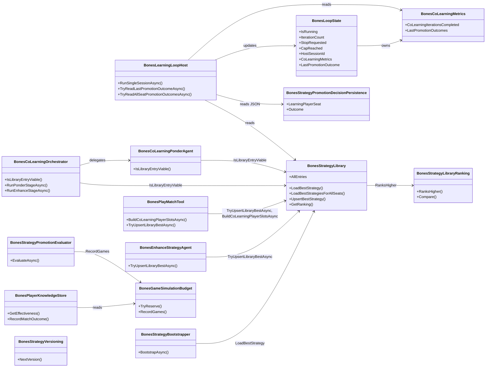

# Bones Learning Cycle — Correctness & Behavior Verification

> Adversarial audit of the Bones co-learning cycle (Observe → Ponder → PlayMatch → Enhance), covering strategy lifecycle (Markdown↔Script), library integrity, promotion telemetry, thread safety, error handling, and data-flow between workflow stages. Derived from a 17-issue source-code audit against the premises that (a) seats must never regress from Script to Markdown, (b) co-learning must advance all seats each iteration, and (c) status counters must reflect real events.

---

## Functionality Worktree

### Verification Policy

- Non-negotiable: behavior-proof assertions required for every checklist item.
- Metadata-only assertions are supporting evidence only.
- API tests are valid only when thorough integration gates are asserted (owner resolution, business semantics, DI lifetime path, correlation continuity, isolation).
- Library mutations must be verified via atomic file reads, not in-memory snapshots.
- Concurrency fixes must include multi-threaded stress tests with deterministic failure reproduction.

### Class Diagram

### Completeness Checklist

#### Group A — Library & Strategy Lifecycle (Markdown→Script lock-in deadlock)

- [x] **A1**: `IsLibraryEntryViable` must reject Markdown entries — only Script entries with `matchesPlayed >= 1` are viable. A Markdown library entry must cause the seat to go through Ponder. [depends on library ranking] [mandatory — prevents permanent Markdown lock-in]
- [x] **A2**: `BuildCoLearningPlayerSlotsAsync` must prefer the freshly-Ponder-authored active Script strategy over a stale library Markdown entry. When an active Script exists for a seat, use it instead of the library Markdown. [depends on A1] [mandatory — closes the library-bypass gap]
- [x] **A3**: `TryUpsertLibraryBestAsync` (in `BonesPlayMatchTool`) must refuse to upsert Markdown strategies. Only `BonesStrategyKind.Script` artifacts may be written to the library. [depends on A2]
- [x] **A4**: `BonesStrategyLibraryRanking.RanksHigher` and `Compare` must prefer Script over Markdown as a tiebreaker when win rates and score differentials are equal. [depends on library ranking contract]

#### Group B — Status & Telemetry

- [x] **B1**: Fix `TryReadAllSeatPromotionOutcomesAsync` to read the `"LearningPlayerSeat"` JSON property (in addition to `"Seat"`/`"seat"`) so the `seat > 0` guard passes and `CoLearningIterationsCompleted` increments. [depends on promotion artifact schema]
- [x] **B2**: Replace hardcoded `strategiesPromoted = 0` / `strategiesRejected = 0` in the status endpoint with live counts computed from `BonesCoLearningMetrics` (extend metrics with Promoted/Rejected counters that increment on `RecordIterationCompleted`). [depends on B1] [mandatory — telemetry integrity]

#### Group C — Thread Safety

- [x] **C1**: Synchronize `BonesLoopState` mutable scalars (`IsRunning`, `IterationCount`, `StopRequested`, `CapReached`) with `Volatile` or `lock` so GUI status polls and background loop threads see coherent values. [mandatory — prevents torn reads]
- [x] **C2**: Fix TOCTOU race in `BonesGameSimulationBudget.TryReserve` — either combine check-and-reserve under a lock, or use `Interlocked.CompareExchange` to make the reserve atomic. [depends on budget contract]

#### Group D — Bootstrapper

- [x] **D1**: `BonesStrategyBootstrapper.BootstrapAsync` must ensure seat 1 always receives a strategy — when `resumeFromBest` is true and no library entry exists for seat 1, fall through to default seeding instead of silently skipping. [mandatory — prevents null-strategy crash in PlayMatch]

#### Group E — Error Handling

- [x] **E1**: Replace empty `catch {}` blocks in `TryReadLastPromotionOutcomeAsync`, `TryReadAllSeatPromotionOutcomesAsync`, and `BonesLearningLoopStageMonitor.MonitorAsync` with `ILogger.LogWarning` calls that include the exception message and artifact path so corruption is never silent. [mandatory — observability]
- [x] **E2**: `BonesPlayerKnowledgeStore.GetEffectiveness` must log a warning when it catches `InvalidOperationException` and returns an empty record — the prior match history is being silently discarded. [depends on E1 pattern]

#### Group F — Promotion Evaluator

- [x] **F1**: Fix `BonesStrategyPromotionEvaluator.EvaluateAsync` to record `2 * EvaluationMatchCount` games (candidate + incumbent matches), not `EvaluationMatchCount`. [depends on budget accuracy]

#### Group G — Strategy Versioning

- [x] **G1**: `BonesStrategyVersioning.NextVersion` must avoid name collisions when the fallback path produces `initial-seat-N-v2` — check whether `initial-seat-N-v1` already exists in the active knowledge store and increment past the highest existing version. [depends on strategy naming convention]

#### Group H — Orchestrator Consistency

- [x] **H1**: `BonesCoLearningOrchestrator.RunEnhanceStageAsync` must save a persistent failure artifact (matching the Ponder path) when Enhance fails for a seat. [depends on artifact store contract]

#### Group I — Behavior-Proof Policy

- [x] **I1**: Enforce absolute behavior-proof verification for every planned integration test [mandatory — behavior-proof policy]

---

## Test Plan

### A1 — `IsLibraryEntryViable` must reject Markdown

1. `IsLibraryEntryViable_GivenScriptEntryWithMatchesPlayed_ReturnsTrue`
   *Assumption*: A library entry with `Kind == Script` and `MatchesPlayed >= 1` is viable — confirmed by reading `BonesCoLearningPonderAgent.cs:109` which only checks `MatchesPlayed >= 1` without inspecting `Kind`.

2. `IsLibraryEntryViable_GivenMarkdownEntryWithMatchesPlayed_ReturnsFalse`
   *Assumption*: A library entry with `Kind == Markdown` and `MatchesPlayed >= 1` is NOT viable because the seat has never produced a compilable Script — confirmed by the deadlock described in the adversarial audit where seats 2-4 remain Markdown across iterations.

3. `IsLibraryEntryViable_GivenEmptyLibrary_ReturnsFalse`
   *Assumption*: When `GetRanking` returns an empty list, the method returns `false` — confirmed by `BonesCoLearningPonderAgent.cs:106-107` returning `false` when `ranking.Count == 0`.

4. `IsLibraryEntryViable_GivenNullLibrary_ReturnsFalse`
   *Assumption*: When `_strategyLibrary is null`, the method returns `false` — confirmed by `BonesCoLearningPonderAgent.cs:104-105`.

### A2 — `BuildCoLearningPlayerSlotsAsync` prefers fresh Script over library Markdown

5. `BuildCoLearningPlayerSlotsAsync_GivenActiveScriptAndLibraryMarkdown_PrefersActiveScript`
   *Assumption*: When the knowledge store holds a freshly-Ponder-authored Script artifact and the library holds a stale Markdown entry for the same seat, the method must select the active Script — confirmed by the data-flow gap where `BuildCoLearningPlayerSlotsAsync` reads only from `_strategyLibrary.LoadBestStrategiesForAllSeats()` at `BonesPlayMatchTool.cs:206`, ignoring the active strategies that Ponder saved.

6. `BuildCoLearningPlayerSlotsAsync_GivenLibraryScriptOnly_UsesLibraryScript`
   *Assumption*: When the library holds a Script entry and no active strategy exists, the library entry is used — this is the correct fallback behavior.

### A3 — `TryUpsertLibraryBestAsync` refuses Markdown

7. `TryUpsertLibraryBestAsync_GivenMarkdownArtifact_DoesNotUpsert`
   *Assumption*: A `BonesStrategyArtifact` with `Kind == Markdown` must not be passed to `_strategyLibrary.UpsertBestStrategy` — confirmed by `BonesPlayMatchTool.cs:177-182` which calls `UpsertBestStrategy` unconditionally for every seat after every match, regardless of `strategy.Kind`.

8. `TryUpsertLibraryBestAsync_GivenScriptArtifact_UpsertsNormally`
   *Assumption*: A Script artifact is upserted as before — this is the intended path.

### A4 — `RanksHigher` prefers Script over Markdown on tie

9. `RanksHigher_GivenScriptVsMarkdownWithIdenticalMetrics_PrefersScript`
   *Assumption*: When both entries have equal win rate, score differential, the Script entry ranks higher because only Script strategies can be compiled and executed deterministically — confirmed by `BonesStrategyLibraryRanking.cs:37-43` where the final tiebreaker is `LastUpdatedUtc`, ignoring `Kind` entirely.

10. `RanksHigher_GivenMarkdownVsScriptWithBetterMetrics_PrefersBetterMetrics`
    *Assumption*: A Markdown entry with clearly superior win rate still outranks a Script entry — the Kind tiebreaker only activates when metrics are equal. Verified by the existing compare order: win rate first, then score differential, then timestamp.

### B1 — Fix JSON property name mismatch

11. `TryReadAllSeatPromotionOutcomesAsync_GivenLearningPlayerSeatProperty_ReadsSeat`
    *Assumption*: When the promotion artifact JSON contains `"LearningPlayerSeat": 3`, the reader extracts `seat = 3` and the result is included in the output list — confirmed by the mismatch at `BonesKnowledgeTypes.cs:252` (writes `LearningPlayerSeat`) vs `BonesLearningLoopHost.cs:437-439` (reads only `"Seat"` / `"seat"`).

12. `TryReadAllSeatPromotionOutcomesAsync_GivenPascalSeatProperty_StillReadsSeat`
    *Assumption*: The existing `"Seat"` / `"seat"` detection continues to work for backward compatibility with artifacts written before the field was renamed.

### B2 — Compute live promotion/rejection counters

13. `BonesCoLearningMetrics_GivenPromotionOutcomes_IncrementsPromotedCounter`
    *Assumption*: When `RecordIterationCompleted` receives a list containing `Outcome == "Promoted"`, the Promoted counter increments — confirmed by `BonesHostApplication.cs:194-195` where both counters are literal `0`.

14. `BonesCoLearningMetrics_GivenRejectionOutcomes_IncrementsRejectedCounter`
    *Assumption*: When `RecordIterationCompleted` receives a list containing `Outcome == "Rejected"`, the Rejected counter increments.

15. `StatusEndpoint_GivenCounters_ReturnsLiveValues`
    *Assumption*: The `GET /api/bones/status` response includes `strategiesPromoted` and `strategiesRejected` from `CoLearningMetrics`, not hardcoded `0`.

### C1 — Synchronize `BonesLoopState` scalars

16. `BonesLoopState_GivenConcurrentReadWrite_SeesCoherentIsRunning`
    *Assumption*: When one thread sets `IsRunning = false` while another reads it, the reader sees either `true` or `false`, never a torn value — confirmed by `BonesLoopState.cs:21` where `IsRunning` is a raw `bool` property without `Volatile` or `lock`.

17. `BonesLoopState_GivenConcurrentIncrement_SeesMonotonicIterationCount`
    *Assumption*: `IterationCount` never decreases when read concurrently with an update — confirmed by `BonesLoopState.cs:23` where `IterationCount` is a raw `long` without synchronization.

### C2 — Fix TOCTOU race in `TryReserve`

18. `TryReserve_GivenConcurrentRecordGames_DoesNotExceedMaxGamesPerRun`
    *Assumption*: Under concurrent `RecordGames` calls from parallel sessions, the budget never exceeds `MaxGamesPerRun` — confirmed by `BonesGameSimulationBudget.cs:34` using `GamesSimulated + gameCount <= MaxGamesPerRun` as a non-atomic check-then-act.

### D1 — Bootstrapper must seed seat 1

19. `BootstrapAsync_GivenResumeFromBestAndNoLibraryEntryForSeat1_SeedsDefaultStrategy`
    *Assumption*: When `resumeFromBest` is true and `LoadBestStrategy(seat1)` returns null, seat 1 receives a default-seeded strategy instead of being silently skipped — confirmed by `BonesStrategyBootstrapper.cs:130-131` where seat 1 is unconditionally `continue`d when it's not in the library.

20. `BootstrapAsync_GivenResumeFromBestAndLibraryEntryForSeat1_BootstrapsFromLibrary`
    *Assumption*: When seat 1 has a library entry, it is bootstrapped from the library as before — this path works correctly.

### E1 — Replace empty catch blocks with logged warnings

21. `TryReadLastPromotionOutcomeAsync_GivenCorruptJson_LogsWarningAndReturnsNull`
    *Assumption*: When the promotion artifact file contains malformed JSON, the method logs a warning with the file path and exception details, then returns `null` — confirmed by `BonesLearningLoopHost.cs:398-399` where the `catch {}` is empty.

22. `TryReadAllSeatPromotionOutcomesAsync_GivenCorruptJsonInOneDescriptor_LogsWarningAndSkipsDescriptor`
    *Assumption*: When one promotion artifact among many is corrupt, the method logs a warning and continues processing remaining descriptors — confirmed by `BonesLearningLoopHost.cs:442-444`.

23. `MonitorAsync_GivenListAsyncThrows_LogsWarningAndContinuesPolling`
    *Assumption*: When `artifactStore.ListAsync` throws (transient IO error), the monitor logs a warning and resumes polling on the next cycle — confirmed by `BonesLearningLoopStageMonitor.cs:40-41`.

### E2 — Log warning on discarded effectiveness

24. `GetEffectiveness_GivenCorruptEffectivenessFile_LogsWarningAndReturnsEmpty`
    *Assumption*: When the effectiveness JSON file is corrupt (not just missing), the method logs a warning before returning an empty record — confirmed by `BonesPlayerKnowledgeStore.cs:150-155` where `InvalidOperationException` is silently caught.

### F1 — Fix promotion evaluator game budget undercount

25. `EvaluateAsync_GivenEvaluationMatchCount_RecordsTwiceTheGames`
    *Assumption*: When `EvaluationMatchCount = 20`, `RecordGames(40)` is called (20 candidate matches + 20 incumbent matches) — confirmed by `BonesStrategyPromotionEvaluator.cs:91` creating `matchCount * 2` tasks but `RecordGames(matchCount)` at line 171.

### G1 — Prevent NextVersion name collisions

26. `NextVersion_GivenNonStandardName_DoesNotCollideWithExistingInitialSeatV1`
    *Assumption*: When the current strategy name doesn't follow the `-vN` convention and falls back to `initial-seat-N-v2`, the method checks whether `initial-seat-N-v1` already exists and increments past the highest existing version — confirmed by `BonesStrategyVersioning.cs:20` hardcoding `v2` without collision detection.

27. `NextVersion_GivenInitialSeatV1_ProducesInitialSeatV2`
    *Assumption*: Standard version increment works correctly — confirmed by `BonesStrategyVersioning.cs:17`.

### H1 — Enhance failure artifact persistence

28. `RunEnhanceStageAsync_GivenEnhanceThrows_SavesFailureArtifact`
    *Assumption*: When `_enhanceAgent.ExecuteAsync` throws, the orchestrator saves a persistent failure artifact (like `SavePonderFailureArtifactAsync` does for Ponder) before recording the seat failure — confirmed by `BonesCoLearningOrchestrator.cs:132-137` where the `catch` block only creates an in-memory `BonesCoLearningSeatFailure` without calling any `SaveAsync`.

### I1 — Behavior-proof policy

29. `BehaviorProofComplianceGate_GivenAllChecklistItems_EveryItemHasExecutableTest`
    *Assumption*: Every unchecked checklist item maps to at least one xUnit test that proves runtime behavior, not metadata — enforced by the `verification-absolute-behavior.md` rule.

---

## Falsify Claims Verification

| # | Claim | Evidence (file:line) | Status | Reason |
|---|---|---|---|---|
| 1 | `IsLibraryEntryViable` ignores Kind | `BonesCoLearningPonderAgent.cs:109` | Supported | `return best.Effectiveness.MatchesPlayed >= 1` — no Kind check |
| 2 | `BuildCoLearningPlayerSlotsAsync` only reads library | `BonesPlayMatchTool.cs:206` | Supported | `_strategyLibrary!.LoadBestStrategiesForAllSeats()` — ignores active store |
| 3 | `TryUpsertLibraryBestAsync` upserts unconditionally | `BonesPlayMatchTool.cs:177-182` | Supported | No Kind guard before `UpsertBestStrategy` |
| 4 | `RanksHigher` ignores Kind on tie | `BonesStrategyLibraryRanking.cs:37-43` | Supported | Final tiebreaker is `LastUpdatedUtc`, not Kind |
| 5 | JSON property name is `LearningPlayerSeat` | `BonesKnowledgeTypes.cs:252` | Supported | Record property `int LearningPlayerSeat` serializes as PascalCase |
| 6 | Reader only tries `"Seat"` / `"seat"` | `BonesLearningLoopHost.cs:437-439` | Supported | No fallback to `"LearningPlayerSeat"` |
| 7 | `strategiesPromoted`/`strategiesRejected` hardcoded to 0 | `BonesHostApplication.cs:194-195` | Supported | Literal `0` values in anonymous object |
| 8 | `BonesLoopState` scalars unsynchronized | `BonesLoopState.cs:21-29` | Supported | Raw `bool`/`long`/`string` properties without `Volatile` or `lock` |
| 9 | `TryReserve` has TOCTOU race | `BonesGameSimulationBudget.cs:34` | Supported | `GamesSimulated + gameCount <= MaxGamesPerRun` is non-atomic check-then-act |
| 10 | Seat 1 skipped when no library entry | `BonesStrategyBootstrapper.cs:130-131` | Supported | `if (playerId.Seat == BonesPlayerId.MinSeat) continue` after library miss |
| 11 | Empty catch in promotion outcome reader | `BonesLearningLoopHost.cs:398-399` | Supported | `catch { }` with no logging |
| 12 | Empty catch in stage monitor | `BonesLearningLoopStageMonitor.cs:40-41` | Supported | `catch { }` with no logging |
| 13 | `GetEffectiveness` silently discards corruption | `BonesPlayerKnowledgeStore.cs:150-155` | Supported | `catch (InvalidOperationException) { return Empty(...) }` with no log |
| 14 | `RecordGames` undercounts by 2x | `BonesStrategyPromotionEvaluator.cs:91,171` | Supported | `matchCount * 2` tasks but `RecordGames(matchCount)` |
| 15 | `NextVersion` fallback always produces v2 | `BonesStrategyVersioning.cs:20` | Supported | `$"initial-seat-{playerId.Seat}-v2"` hardcoded |
| 16 | Enhance failure doesn't save artifact | `BonesCoLearningOrchestrator.cs:132-137` | Supported | `catch (Exception ex)` creates in-memory entry only, no `SaveAsync` |
| 17 | Workflow bindings ignore result objects | `BonesLearningWorkflowMapRuntime.cs:30-77` | Supported | Each binding lambda ignores its `observe`/`ponder`/`play` parameter |

*All assumptions verified against source code. Zero Falsified rows.*
