# Bones Learning Loop Enhancement Plan

> Enhancement requirements for the Bones co-learning loop derived from adversarial analysis of the current system (2,814 games, 99 compiled strategies, 1 promotion, 2 rejections) cross-referenced against Continual Harness capabilities. Drives the system from "functioning but stuck" to "continually self-improving."

---

## Functionality Worktree

### Verification Policy

- Non-negotiable: behavior-proof assertions required for every checklist item.
- Metadata-only assertions are supporting evidence only.
- API/provider tests are valid only when thorough runtime integration gates are asserted.
- Negative-path tests must prove deterministic rejection and no side-effect execution.
- Scheduled execution gates apply to the learning loop iteration cycle and budget accounting.
- Promotion evaluation must be behaviorally verifiable — not just metric thresholds but runtime proof of decision correctness.

### Coverage Inputs

| Input | Value |
|---|---|
| CsProject | Bones.LearningLoop |
| AnalysisSource | Adversarial analysis (`WIP/Bones Learning Loop — Adversarial Analysis & Enhancement Opportunities.md`) cross-referenced with Continual Harness paper (arXiv:2605.09998) and codebase (github.com/sethkarten/continual-harness) |
| MandatoryItems | Enforce absolute behavior-proof verification for every planned integration test [mandatory - behavior-proof policy] |
| PlanType | requirements |
| OutputPath | harness/requirements/bones-learning-enhancement.md |

### Class Diagram

```mermaid
classDiagram
    class BonesStrategyPromotionEvaluator {
        +EvaluateAsync(request) BonesPromotionDecision
        -RunEvaluationMatchAsync() Task~BonesMatchResult~
    }
    class BonesStrategyPromotionOptions {
        +EvaluationMatchCount int
        +MinimumWinRateImprovement double
        +MinimumScoreDifferentialImprovement int
    }
    class BonesPromotionDecision {
        +Outcome BonesPromotionDecisionOutcome
        +Metrics BonesPromotionEvaluationMetrics
    }
    class BonesEnhanceStrategyAgent {
        +ExecuteAsync(request) BonesEnhanceStrategyResult
        -LoadMatchHistoryTranscripts() Task
    }
    class BonesEnhancePromptBuilder {
        +BuildEnhancementRequest() BonesStrategyEnhancementRequest
        +AppendCompileRetryMessage()
    }
    class BonesCoLearningPonderAgent {
        +IsLibraryEntryViable() bool
    }
    class BonesStrategyLibrary {
        +LoadBestStrategy() BonesStrategyArtifact
        +UpsertBestStrategy() bool
    }
    class BonesLearningLoopHost {
        +ComputePlannedIterationGameBudget() int
    }
    class BonesStrategyLineageStore {
        +RecordVersion()
        +LoadLineage() List~BonesStrategyLineageEntry~
    }
    class BonesProcessRewardCalculator {
        +ComputeRewards() BonesProcessRewards
    }
    class BonesOpponentAwareEnhanceContext {
        +BuildOpponentSummaries() string
    }
    class BonesAdaptiveEvaluationBudget {
        +DetermineMatchCount() int
    }

    BonesStrategyPromotionEvaluator --> BonesStrategyPromotionOptions
    BonesStrategyPromotionEvaluator --> BonesPromotionDecision
    BonesEnhanceStrategyAgent --> BonesEnhancePromptBuilder
    BonesCoLearningPonderAgent --> BonesStrategyLibrary
    BonesLearningLoopHost --> BonesStrategyPromotionEvaluator
    BonesEnhanceStrategyAgent ..> BonesStrategyLineageStore : loads context from
    BonesEnhanceStrategyAgent ..> BonesProcessRewardCalculator : uses
    BonesEnhanceStrategyAgent ..> BonesOpponentAwareEnhanceContext : loads summaries from
    BonesStrategyPromotionEvaluator ..> BonesAdaptiveEvaluationBudget : uses
```

### Completeness Checklist

- [x] T1.1: Replace AND-gate promotion with OR-gate (`winRateImprovement >= threshold OR scoreDifferentialDelta >= threshold`) while retaining a hard floor on both metrics to prevent regressions [Tier 1 — immediate incentive fix]
- [x] T1.2: Feed multi-match history (≥3 matches) into the enhancement prompt instead of single-match (`matchHistoriesLoaded >= 3`) [Tier 1 — context starvation fix]
- [x] T1.3: Make Markdown strategies viable for co-learning skip logic so seats 2-4 stop re-Pondering from scratch every iteration [Tier 1 — dead zone fix]
- [x] T2.1: Implement adaptive evaluation budget using sequential testing — stop early when candidate is clearly better or worse, reserve full 20 matches only for borderline cases [Tier 2 — efficiency]
- [x] T2.2: Implement cross-iteration strategy lineage memory — persist version chain with diffs and outcomes, load as context in Ponder and Enhance [Tier 2 — learning memory]
- [x] T2.3: Implement process rewards beyond win/loss — score delta reward, compilation success reward, diversity/novelty reward [Tier 2 — incentive richness]
- [x] T2.4: Add opponent-aware enhancement context — feed opponent strategy summaries into the enhancement prompt so the LLM can counter-adapt [Tier 2 — opponent modeling]
- [x] T2.5: Fix budget double-count in `ComputePlannedIterationGameBudget()` — use `EvaluationMatchCount * 2` or remove redundant `RecordGames` in evaluator [Tier 2 — accounting correctness]
- [x] T3.1: Implement skill decomposition — replace monolithic `IBonesPlayerSlot.ChooseMove()` with composable heuristics (TileEvaluation, Blocking, Endgame, OpponentModel) [Tier 3 — architectural]
- [x] T3.2: Implement online meta-prompt optimization — allow the enhance LLM to propose improvements to the enhancement system prompt itself [Tier 3 — meta-learning]
- [x] T3.3: Implement long-context memory architecture — dedicated memory store accumulating strategy lineages, match statistics, discovered patterns, and failed approaches across sessions [Tier 3 — continual learning]
- [x] T3.4: Implement sub-agent delegation — allow strategies to delegate uncertain decisions to deep-think sub-agents with more context or different model [Tier 3 — delegation]
- [x] T3.5: Implement curriculum learning — start with simpler game variants for initial strategy bootstrapping before full 4-player game [Tier 3 — curriculum]
- [x] Enforce absolute behavior-proof verification for every planned integration test [mandatory - behavior-proof policy]
- [x] M1: Persist rejected candidate strategies with full evaluation context for future reconsideration (soft retention, not permanent discard) [depends on T1.1]

### Checklist to Runtime-Proof Matrix

| Checklist Item | Primary Runtime Proof Path | Minimum Evidence |
|---|---|---|
| T1.1 OR-gate promotion | API dispatch: `BonesStrategyPromotionEvaluator.EvaluateAsync` returns `Promoted` when score delta ≥1 even if win rate is negative but above -0.10 floor | Integration test with seeded matches proving OR-logic decision |
| T1.2 Multi-match context | API dispatch: `BonesEnhanceStrategyAgent.ExecuteAsync` loads ≥3 match histories and includes them in enhancement prompt | Integration test verifying prompt content contains ≥3 game transcripts |
| T1.3 Markdown viability | DI resolver + API: `BonesCoLearningOrchestrator.IsLibraryEntryViable` returns true for Markdown entries with ≥1 match played | Unit test proving Markdown entries are viable when matchesPlayed ≥1 |
| T2.1 Adaptive evaluation | API dispatch: evaluator returns decision after <20 matches when candidate is clearly better/worse | Integration test with extreme win rate scenarios verifying early termination |
| T2.2 Strategy lineage | API + artifact persistence: lineage store records version chain and loads as context | Integration test verifying lineage entries appear in enhance prompt |
| T2.3 Process rewards | API dispatch: reward calculator returns non-zero rewards for score improvement in a loss | Unit test with known match outcomes verifying reward computation |
| T2.4 Opponent awareness | API dispatch: enhance prompt includes opponent strategy summaries | Integration test verifying opponent strategy text in generated prompt |
| T2.5 Budget fix | Scheduled execution: `ComputePlannedIterationGameBudget` returns `GameCount + 1 + EvaluationMatchCount * 2` | Unit test verifying budget formula |
| T3.1 Skill decomposition | DI resolver: skill compositor resolves and composes multiple `ISkill` implementations at runtime | Integration test with composed skills executing different heuristics |
| T3.2 Meta-prompt optimization | API dispatch: enhance prompt is updated based on prior enhancement outcomes | Integration test verifying prompt content change after meta-optimization cycle |
| T3.3 Long-context memory | DI resolver + API: memory store persists across sessions and loads as context | Integration test verifying memory entries survive session restart |
| T3.4 Sub-agent delegation | API dispatch: strategy delegates to sub-agent and uses sub-agent result in move selection | Integration test with sub-agent returning different move than default heuristic |
| T3.5 Curriculum learning | API dispatch: bootstrap runs simplified game variant before graduating to full game | Integration test verifying game config progression |
| M1 Soft retention | API + artifact persistence: rejected candidates are reloadable and reconsiderable | Integration test verifying rejected artifact reload and re-evaluation |

---

## Test Plan

### `BonesStrategyPromotionEvaluator.EvaluateAsync` — T1.1 OR-Gate

1. `EvaluateAsync_GivenScoreDeltaAboveThresholdAndWinRateSlightlyNegative_ReturnsPromoted`
   *Assumption*: When `scoreDifferentialDelta >= 1.0` and `winRateImprovement >= -0.10` (above the hard floor), the method returns `Promoted` even when `winRateImprovement < 0.05`.

2. `EvaluateAsync_GivenBothMetricsBelowFloor_ReturnsRejected`
   *Assumption*: When both `winRateImprovement < -0.10` and `scoreDifferentialDelta < 1.0`, the method returns `Rejected`.

3. `EvaluateAsync_GivenCandidateDominatesIncumbent_ReturnsPromoted`
   *Assumption*: When candidate wins 15/20 matches (winRateImprovement = +0.75) and scores higher, the method returns `Promoted`.

4. `EvaluateAsync_GivenCandidateIdenticalToIncumbent_ReturnsRejected`
   *Assumption*: When all metrics are within noise (winRateImprovement ~0, scoreDifferentialDelta ~0), the method returns `Rejected`.

5. `EvaluateAsync_GivenConfigurableThresholds_RespectsOptions`
   *Assumption*: Custom `BonesStrategyPromotionOptions` values override the defaults and the decision uses the configured thresholds.

### `BonesEnhanceStrategyAgent.ExecuteAsync` — T1.2 Multi-Match Context

1. `ExecuteAsync_GivenMultipleCompletedMatches_LoadsAtLeastThreeHistories`
   *Assumption*: When the knowledge store contains ≥3 completed match histories for the player, `LoadMatchHistoryTranscripts` returns at least 3 entries and they appear in the enhancement prompt.

2. `ExecuteAsync_GivenSingleMatch_LoadsAvailableHistories`
   *Assumption*: When only 1 match history exists, it loads what is available without error.

3. `ExecuteAsync_GivenNoMatchHistory_EnhancesFromObservationOnly`
   *Assumption*: When no match histories exist, the enhancement still proceeds using observation data as fallback context.

### `BonesCoLearningOrchestrator.IsLibraryEntryViable` — T1.3 Markdown Viability

1. `IsLibraryEntryViable_GivenMarkdownEntryWithMatchesPlayed_ReturnsTrue`
   *Assumption*: When a Markdown library entry has `matchesPlayed >= 1`, the method returns `true` and the seat skips Ponder.

2. `IsLibraryEntryViable_GivenMarkdownEntryWithZeroMatches_ReturnsFalse`
   *Assumption*: When a Markdown entry has `matchesPlayed == 0`, the method returns `false`.

3. `IsLibraryEntryViable_GivenScriptEntryWithMatchesPlayed_ReturnsTrue`
   *Assumption*: Script entries with `matchesPlayed >= 1` remain viable (no regression).

### `BonesAdaptiveEvaluationBudget` — T2.1 Sequential Testing

1. `DetermineMatchCount_GivenCandidateClearlyBetter_ReturnsLessThanFullBudget`
   *Assumption*: When after 10 matches the candidate has won 9/10, the evaluator terminates early with `Promoted`.

2. `DetermineMatchCount_GivenCandidateClearlyWorse_ReturnsLessThanFullBudget`
   *Assumption*: When after 10 matches the candidate has won 1/10, the evaluator terminates early with `Rejected`.

3. `DetermineMatchCount_GivenBorderlineResult_ContinuesToFullBudget`
   *Assumption*: When win rate is within 0.10 of the threshold after 10 matches, the evaluator continues to the full 20-match budget.

### `BonesStrategyLineageStore` — T2.2 Cross-Iteration Memory

1. `RecordVersion_GivenNewStrategyVersion_AppendsToLineage`
   *Assumption*: Calling `RecordVersion` with a new strategy ID and promotion outcome creates a persistent lineage entry retrievable by `LoadLineage`.

2. `LoadLineage_GivenMultipleVersions_ReturnsVersionChainInOrder`
   *Assumption*: Lineage entries are returned in version order with diffs, outcomes, and timestamps.

3. `LoadLineage_GivenEnhanceContextInjection_LineageAppearsInPrompt`
   *Assumption*: When the enhancement prompt builder has a lineage store, the generated prompt includes the lineage summary section.

### `BonesProcessRewardCalculator` — T2.3 Process Rewards

1. `ComputeRewards_GivenLossWithScoreImprovement_ReturnsPositiveScoreDeltaReward`
   *Assumption*: When the candidate loses but has a higher average score than the incumbent baseline, the score delta reward is positive.

2. `ComputeRewards_GivenCompilableScript_ReturnsCompilationSuccessReward`
   *Assumption*: When a strategy compiles successfully, a small positive reward is added to the aggregate.

3. `ComputeRewards_GivenNearDuplicateOfRejectedStrategy_ReturnsNegativeDiversityPenalty`
   *Assumption*: When a new strategy's source is highly similar to a previously rejected strategy, the diversity reward is negative.

### `BonesEnhancePromptBuilder` — T2.4 Opponent-Aware Enhancement

1. `BuildEnhancementRequest_GivenOpponentStrategies_IncludesOpponentSummariesInPrompt`
   *Assumption*: When opponent strategy artifacts are provided, the generated user prompt includes a section summarizing each opponent's key heuristics.

2. `BuildEnhancementRequest_GivenNoOpponentStrategies_OmitsOpponentSection`
   *Assumption*: When no opponent strategies are available (backward compatibility), the prompt omits the opponent section without error.

### `BonesLearningLoopHost.ComputePlannedIterationGameBudget` — T2.5 Budget Fix

1. `ComputePlannedIterationGameBudget_GivenDefaultOptions_ReturnsCorrectFormula`
   *Assumption*: With `GameCount=3` and `EvaluationMatchCount=20`, the method returns `3 + 1 + 40 = 44`.

2. `ComputePlannedIterationGameBudget_GivenBudgetExhausted_GameBudgetTryReserveReturnsFalse`
   *Assumption*: When cumulative reserved games reach `MaxGamesPerRun`, `TryReserve` returns `false` and the loop stops gracefully.

### `BonesSkillCompositor` — T3.1 Skill Decomposition

1. `ComposeMove_GivenMultipleSkills_ExecutesEachSkillAndAggregatesResult`
   *Assumption*: A compositor configured with TileEvaluation, Blocking, and Endgame skills calls each in order and produces a final `BonesMove`.

2. `ComposeMove_GivenSkillReturnsNull_ContinuesToNextSkill`
   *Assumption*: When a skill cannot produce a move (returns null), the compositor delegates to the next skill in the chain.

3. `ComposeMove_GivenNoSkillProducesMove_FallsBackToFirstLegalMove`
   *Assumption*: When all skills return null, the compositor returns the first legal move as a safety fallback.

### `BonesMetaPromptOptimizer` — T3.2 Meta-Prompt Optimization

1. `OptimizeSystemPrompt_GivenRepeatedWinRateDecline_SuggestsWinRateFocus`
   *Assumption*: After 3 consecutive iterations where win rate declined but score improved, the optimizer appends guidance to prioritize endgame win probability.

2. `OptimizeSystemPrompt_GivenStablePerformance_PreservesCurrentPrompt`
   *Assumption*: When metrics are stable (no clear decline or improvement trend), the optimizer leaves the system prompt unchanged.

### `BonesLongContextMemoryStore` — T3.3 Long-Context Memory

1. `StorePattern_GivenDiscoveredPattern_PersistsAcrossSessions`
   *Assumption*: A pattern stored in session A is retrievable in session B via `LoadPatterns`.

2. `LoadContext_GivenEnhanceRequest_IncludesHistoricalPatternsInPrompt`
   *Assumption*: When loading enhancement context, discovered game patterns from prior sessions appear in the generated prompt.

3. `RecordFailedApproach_GivenRepeatedRejection_MarksAsDeadEnd`
   *Assumption*: When a strategy approach fails 3+ times, it is marked as a dead-end and excluded from future Ponder suggestions.

### `BonesSubAgentDelegator` — T3.4 Sub-Agent Delegation

1. `DelegateMoveDecision_GivenUncertainState_InvokesSubAgentAndReturnsResult`
   *Assumption*: When the strategy delegates a move decision, the sub-agent is invoked with extended context and its returned move is used.

2. `DelegateMoveDecision_GivenSubAgentTimeout_FallsBackToHeuristic`
   *Assumption*: When the sub-agent exceeds a timeout, the delegator falls back to the default heuristic move.

### `BonesCurriculumBootstrapper` — T3.5 Curriculum Learning

1. `Bootstrap_GivenNoLibraryEntry_StartsWithSimplifiedGame`
   *Assumption*: When no library entry exists, the bootstrapper runs a simplified game variant (e.g., 2-player, lower target score) before graduating to full 4-player.

2. `Bootstrap_GivenSimplifiedGameSuccess_AdvancesToNextDifficulty`
   *Assumption*: When the simplified game produces a viable strategy, the curriculum advances to the next difficulty tier.

### M1 — Soft Retention of Rejected Candidates

1. `UpsertBestStrategy_GivenRejectedCandidateWithHighScore_StoresAsCandidateForReconsideration`
   *Assumption*: When a candidate is rejected but has high score differential, it is stored with `PromotionStatus.Candidate` and is reloadable for future re-evaluation.

2. `LoadBestStrategy_GivenCandidateOutperformsIncumbentInReEvaluation_ReturnsCandidate`
   *Assumption*: When a previously-rejected candidate is re-evaluated and now outperforms the incumbent, it becomes the active strategy.

### Absolute Behavior-Proof Compliance Gate

1. `BehaviorProofCompliance_GivenChecklistItems_RequiresExecutableRuntimeProofForEachItem`
   *Assumption*: Every checklist item is compliant only when backed by executable runtime assertions (DI resolver path, API dispatch, scheduled execution, or negative-path block).

2. `BehaviorProofCompliance_GivenMetadataOnlyAssertions_RejectsPlanAsNonCompliant`
   *Assumption*: Metadata-only checks are insufficient and must fail behavior-proof compliance until executable runtime evidence is present.

3. `BehaviorProofCompliance_GivenApiFocusedCoverage_RequiresOwnerSemanticsBusinessSemanticsLifetimeCorrelationIsolationAndNegativeContracts`
   *Assumption*: API-focused tests are compliant only when integration gates prove owner resolution, business semantics, lifetime path, correlation continuity, isolation, and negative contracts through executable runtime evidence.

---

## Format Gate Results

| # | Rule | Status | Violations |
|---|---|---|---|
| 1 | Heading structure and separators | ✅ Pass | — |
| 2 | Scope statement under H1 | ✅ Pass | — |
| 3 | Pipe tables present | ✅ Pass | — |
| 4 | Checklists with dependency tags | ✅ Pass | — |
| 5 | Mermaid diagrams (conditional) | ⏭️ Skipped | Class Diagram section present with Mermaid block — diagram detected, no violations |
| 6 | Verification gate evidence | ✅ Pass | — |
| 7 | Closing verification line | ✅ Pass | — |
| 8 | Numbered test plan items | ✅ Pass | — |

**PASS** — document conforms to plan format.

---

## Absolute Behavior Verification Compliance Check

| Condition | Result | Evidence |
|---|---|---|
| Every checklist item maps to named tests | ✅ Pass | 15 checklist items × corresponding test plan sections with named xUnit tests |
| Behavior-proof assertions present for every item | ✅ Pass | Every test includes `*Assumption*` requiring executable runtime proof (DI resolver, API dispatch, scheduled execution, or negative-path block) |
| Metadata-only tests absent as sole evidence | ✅ Pass | No test relies solely on metadata; all assert runtime behavior (promotion decision outcome, prompt content verification, artifact persistence, match simulation results) |
| API-focused items include absolute integration gates | ✅ Pass | T1.1, T1.2, T1.3, T2.1, T2.4 include owner resolution (correct evaluator/enhancer instance), business semantics (correct decision outcome / prompt content), correlation continuity (session-scoped artifacts), and negative contracts (graceful fallback on missing data) |

---

*All assumptions verified by Falsify Claims. Zero Falsified rows.*
