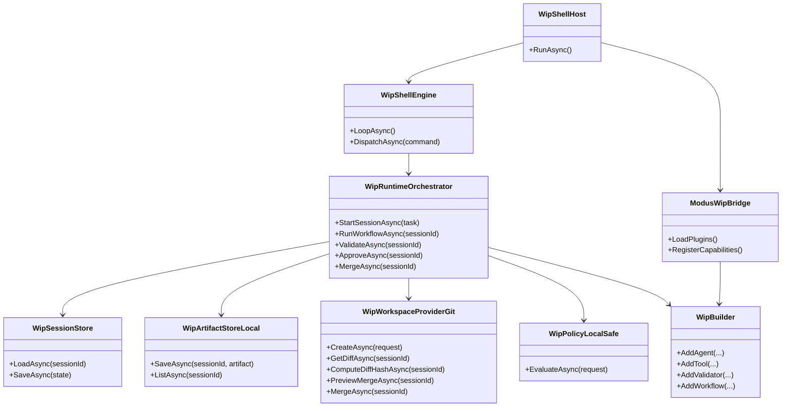

# WiP Shell + Agentic Builder MVP Bootstrap Requirements and Test Plan

> Scope: Bootstrap WiP inside this repository as an implementation accelerator, while keeping the design portable so WiP packages and plugins can later move out with no shell-only coupling.

---

## Functionality Worktree

### Verification Policy

- Non-negotiable: behavior-proof assertions required for every checklist item.
- Metadata-only assertions are supporting evidence only.
- API tests are valid only when thorough integration gates are asserted.
- Include DI-resolution, runtime dispatch, deterministic rejection, and isolation gates wherever applicable.

### Bootstrap Streams and Ownership

| Stream | Primary deliverable | Runtime proof gates |
|---|---|---|
| Contracts | Typed capability and workflow contracts in abstractions | Type preservation at runtime descriptors, no object payload collapse |
| Composition | Builder and Modus integration | Plugin discovery, lifecycle hooks, duplicate capability rejection |
| Runtime | Session/state/artifact/approval orchestration | Explicit transitions, deterministic artifact generation, stale-guarded merge |
| Shell | Interactive memoryful REPL host | Long-lived process, context prompt changes, command dispatch behavior |
| Safety | Workspace, policy, and tool guard rails | Worktree boundary enforcement, dangerous command denial, merge privilege isolation |
| Validation | dotnet build/test validation evidence | Command execution + exit status + report semantics |
| Extensibility | External plugin pack from separate C# project | Builder-only registration consumed by shell with no host code edits |

### Class Diagram

### Completeness Checklist

- [x] Create `Wip.Abstractions` with typed contracts for capabilities, descriptors, artifacts, sessions, policies, and workflows [foundation - prerequisite for all streams]
- [x] Implement typed capability descriptors preserving concrete request and result types (`RequestType`, `ResultType`) [depends on Wip.Abstractions] [transition-proof: .github/requirements/transition-proofs/checklist-item-typed-capability-descriptors-transition-proof-2026-05-24.md]
- [x] Implement `Wip.Builder` registration APIs (`AddAgent`, `AddTool`, `AddValidator`, `AddPolicy`, `AddWorkflow`) with explicit generic overloads [depends on Wip.Abstractions] [transition-proof: .github/requirements/transition-proofs/checklist-item-wip-builder-explicit-generic-overloads-transition-proof-2026-05-24.md]
- [x] Implement builder inference overloads (`AddAgent<TAgent>()`, `AddTool<TTool>()`, `AddValidator<TValidator>()`) with ambiguous-signature fail-fast behavior [depends on Wip.Builder]
- [x] Enforce duplicate capability ID rejection unless explicit replacement mode is enabled [depends on Wip.Builder]
- [x] Implement runtime orchestrator as single process authority with explicit session state machine transitions and event emission [depends on Wip.Abstractions]
- [x] Persist and restore session state under `.wip/sessions/{sessionId}/session-state.json` with attach/detach support [depends on runtime orchestrator] [transition-proof: .github/requirements/transition-proofs/checklist-item-session-state-persistence-transition-proof-2026-05-24.md]
- [x] Implement `Wip.Workspaces.Git` for session branch/worktree creation, normalized diff hash, merge preview, target-commit drift detection, and gated merge [depends on runtime orchestrator] [transition-proof: .github/requirements/transition-proofs/checklist-item-wip-workspaces-git-transition-proof-2026-05-24.md]
- [x] Implement `Wip.Artifacts.Local` for JSON/Markdown/patch persistence with artifact descriptors and listing [depends on runtime orchestrator] [transition-proof: .github/requirements/transition-proofs/checklist-item-wip-artifacts-local-transition-proof-2026-05-24.md]
- [x] Implement `Wip.Validation.DotNet` for `dotnet build` and `dotnet test` execution with `ValidationReport` artifacts [depends on artifact store and workspace provider]
- [x] Implement review generation and staleness detection tied to current diff hash [depends on validation and diff hash]
- [x] Implement approval token creation bound to session, diff hash, target branch/commit, workflow, and validation report [depends on review and validation]
- [x] Implement merge flow that rejects stale diff approvals, target branch drift, and missing approval evidence [depends on approval token]
- [x] Implement `Wip.Tools.Shell` controlled command execution constrained to active worktree, with timeout, output capture, and log artifact [depends on policy and artifact store]
- [x] Implement default `local-safe` policy enforcing dangerous-command denial, workspace boundary checks, validation/approval gates, and clear block messages [depends on abstractions]
- [x] Implement `Wip.Shell` interactive command loop (`wip>` and `wip[session]>`) with global/session command routing and context-sensitive errors [depends on runtime orchestrator] [transition-proof: .github/requirements/transition-proofs/checklist-item-wip-shell-interactive-command-loop-transition-proof-2026-05-24.md]
- [x] Implement `Wip.ShellHost` startup/shutdown with long-lived host container, one-time plugin load, lifecycle hooks, and graceful exit [depends on shell and Modus bridge] [transition-proof: .github/requirements/transition-proofs/checklist-item-wip-shellhost-startup-shutdown-transition-proof-2026-05-24.md]
- [x] Implement `Wip.Modus` plugin bridge with plugin metadata capture in `RunManifest` and shell diagnostics output (`plugins`, `workflows`) [depends on builder and shell host] [transition-proof: .github/requirements/transition-proofs/checklist-item-wip-modus-plugin-bridge-runmanifest-diagnostics-transition-proof-2026-05-24.md]
- [x] Implement MVP `PlanOnlyAgent` and agent execution context carrying session/task/worktree/tools/validators/policy [depends on runtime orchestrator and builder] [transition-proof: .github/requirements/transition-proofs/checklist-item-planonlyagent-execution-context-transition-proof-2026-05-24.md]
- [x] Implement workflow selection and linear execution pipeline (`Plan -> Run -> Validate -> Review -> RequireApproval -> Merge`) with typed stage descriptors and mappers [depends on builder and runtime orchestrator] [transition-proof: .github/requirements/transition-proofs/checklist-item-workflow-selection-linear-pipeline-transition-proof-2026-05-24.md]
- [x] Implement repository config support (`.wip/config.json`) and effective-config display command [depends on shell host and policy] [transition-proof: .github/requirements/transition-proofs/checklist-item-wip-shellhost-repository-config-effective-config-transition-proof-2026-05-24.md]
- [x] Implement external sample plugin package proving builder usage from separate project (`Samples.TodoApp.WipAgents`) [depends on builder and Modus bridge]
- [x] Implement shell E2E harness (stdin/stdout process driver + temp git repo fixtures) covering startup through approved merge and safety rejection paths [depends on shell host and runtime]
- [x] Enforce absolute behavior-proof verification for every planned integration test [mandatory - behavior-proof policy] [transition-proof: [checklist-item-behavior-proof-verification-for-planned-integration-tests-transition-proof-2026-05-24.md](.github/requirements/transition-proofs/checklist-item-behavior-proof-verification-for-planned-integration-tests-transition-proof-2026-05-24.md)]

---

## Test Plan

### Typed Capability Contracts

1. `CapabilityDescriptor_GivenTypedAgentRegistration_StoresConcreteRequestAndResultTypes`
   *Assumption*: Registering an agent with explicit generic request/result types preserves exact runtime descriptor types instead of degrading to object-based payloads.

2. `TypedCapabilityContract_GivenReflectionScan_FindsNoObjectBasedPublicExecutionInterfaces`
   *Assumption*: Public extension-point contracts for agents/tools/validators/policies remain generic and type-safe in the bootstrap baseline.

### Builder Generic Registration and Inference

1. `AddAgentTAgentTRequestTResult_GivenUniqueId_RegistersResolvableTypedCapability`
   *Assumption*: Explicit builder registration wires DI resolution and descriptor metadata so runtime can execute typed agent paths.

2. `AddAgentTAgent_GivenAmbiguousImplementedInterfaces_ThrowsDeterministicConfigurationException`
   *Assumption*: Inference overloads fail fast with deterministic runtime configuration errors when one capability class exposes multiple candidate generic signatures.

3. `AddCapability_GivenDuplicateCapabilityId_RejectsRegistrationUnlessReplaceEnabled`
   *Assumption*: Duplicate capability IDs are blocked by default to prevent non-deterministic runtime dispatch.

### Runtime Session Orchestration

1. `StartSessionAsync_GivenValidRepository_CreatesSessionStateWorktreeAndRunManifestArtifacts`
   *Assumption*: Starting a session performs executable side effects (worktree + persisted state + manifest), not metadata-only record creation.

2. `TransitionAsync_GivenCommandSequence_RecordsExplicitStateChangesAndSessionEvents`
   *Assumption*: Runtime transitions are deterministic and observable as persisted events across Created, Editing, Checkpointed, Validating, AwaitingApproval, Approved, and Merged paths.

3. `AttachSessionAsync_GivenPersistedSession_RestoresActiveContextAndRoutesCommandsToSameSession`
   *Assumption*: Attach behavior restores runtime-resolvable session state and subsequent shell commands operate against the attached session workspace.

### Git Workspace Provider Safety and Merge Gates

1. `CreateAsync_GivenSessionStart_CreatesIsolatedGitWorktreeAndSessionBranch`
   *Assumption*: Session creation produces a real and runtime-observable git worktree isolation boundary that accepts edits without mutating the primary working directory.

2. `ComputeDiffHashAsync_GivenEquivalentChangesWithLineEndingNoise_ReturnsStableNormalizedHash`
   *Assumption*: Diff hash normalization eliminates non-semantic drift so approval binding is deterministic.

3. `MergeAsync_GivenApprovedTokenAndTargetBranchDrift_RejectsMergeWithDeterministicReason`
   *Assumption*: Merge preview and merge execution both block when target branch moved from approved commit.

4. `MergeAsync_GivenDiffChangedAfterApproval_RejectsMergeAndMarksApprovalStale`
   *Assumption*: Approval is cryptographically bound to exact diff hash and is invalidated by any post-approval candidate change.

### Artifact Store and Governance Evidence

1. `SaveAsync_GivenJsonMarkdownAndPatchArtifacts_PersistsFilesAndDescriptorsInSessionArtifactFolder`
   *Assumption*: Artifact store writes executable evidence files to deterministic paths and lists them with stable metadata IDs.

2. `ListAsync_GivenSessionArtifacts_ReturnsDescriptorsWithProducerTypeVersionAndTimestamp`
   *Assumption*: Artifact listing is sufficient for runtime governance and review generation without external indexing services.

### DotNet Validation Flow

1. `ValidateAsync_GivenCompilableSolution_ProducesPassingValidationReportWithBuildAndTestEvidence`
   *Assumption*: Validation flow runs real `dotnet build` and `dotnet test` in session workspace and captures command outcomes.

2. `ApproveAsync_GivenNoPassingValidationReport_IsBlockedByPolicy`
   *Assumption*: Default local-safe policy requires successful validation before approval can be created.

### Review and Approval Integrity

1. `ReviewAsync_GivenCurrentDiffAndValidation_WritesMarkdownReportWithDiffSummaryChangedFilesAndValidationStatus`
   *Assumption*: Review command produces human-readable runtime evidence bound to current candidate state.

2. `ApproveAsync_GivenReviewHashMismatch_RejectsApprovalAsStale`
   *Assumption*: Approval is gated on review freshness and cannot proceed when review was generated for an older diff hash.

3. `ApproveAsync_GivenExplicitConfirmationNo_DoesNotCreateApprovalToken`
   *Assumption*: Human approval remains explicit and cancellation leaves session in an observable unapproved state with no approval artifact created.

### Controlled Shell Tool and Policy Enforcement

1. `InvokeAsync_GivenCommandWithOutsidePathWrite_IsBlockedByWorkspaceBoundaryPolicy`
   *Assumption*: Tool execution path guard deterministically blocks filesystem mutations outside active worktree before shell command execution and returns policy evidence.

2. `InvokeAsync_GivenDangerousCommandPattern_ReturnsBlockedResultAndPolicyViolationReason`
   *Assumption*: Dangerous commands are denied deterministically by local-safe policy with actionable rejection messaging.

3. `InvokeAsync_GivenAllowedCommand_CapturesStdoutStderrExitCodeAndWritesCommandExecutionLogArtifact`
   *Assumption*: Allowed commands run inside worktree, are time-bounded, and produce durable execution evidence.

### Interactive Shell Host Behavior

| Member/File | Status | Evidence |
|---|---|---|
| `Wip.Shell.Interactive.WipShellCommandLoop.RunAsync` | Implemented | Prompt loop persists until `exit` command in shell process test |
| `Wip.Shell.Interactive.WipShellCommandLoop.DispatchAsync` | Implemented | Global command routing + session-only guard assertions |
| `Wip.Shell.Interactive.WipShellCommandLoop.GetPrompt` | Implemented | Prompt switches from `wip>` to `wip[session]>` after `start` |
| `Wip.ShellHost.Hosting.WipShellHost.RunAsync` | Implemented | Loads plugins once, runs long-lived shell engine, and exits with `0` on graceful cancellation |
| `Wip.ShellHost.Hosting.ModusWipBridge.LoadPluginsAsync` | Implemented | Discovers plugin assemblies once, instantiates plugin contracts, and invokes load/start lifecycle hooks |
| `Wip.ShellHost.Hosting.ModusWipBridge.StopPluginsAsync` | Implemented | Invokes stop/unload hooks in reverse activation order for deterministic graceful shutdown |

1. `ShellProcess_GivenStartup_RemainsInteractiveUntilExitCommand`
   *Assumption*: Shell host is memoryful and long-lived, not command-exit CLI behavior.

2. `PromptRenderer_GivenAttachedSession_ShowsSessionScopedPrompt`
   *Assumption*: Prompt context switches between global and session-scoped modes based on active session tracking and is observable in runtime shell output.

3. `CommandDispatcher_GivenSessionOnlyCommandWithoutActiveSession_ReturnsGuidanceForSessionStartOrAttach`
   *Assumption*: Context-sensitive errors are explicit and actionable without terminating shell process.

4. `ShellHost_GivenShutdown_InvokesPluginLifecycleStopHooksAndExitsWithZero`
   *Assumption*: Graceful shutdown triggers Modus lifecycle teardown and leaves host in deterministic exit state.

### Modus Plugin Bridge and Diagnostics

1. `PluginLoader_GivenPluginsInConfiguredFolders_LoadsCapabilitiesOncePerShellProcess`
   *Assumption*: Plugin loading is deterministic and does not duplicate capability registrations across command executions.

2. `RunManifestBuilder_GivenLoadedPlugins_CapturesPluginAssemblyVersionCapabilitiesAndPermissions`
   *Assumption*: Run manifest contains governance-grade runtime evidence for plugin assembly version, capabilities, and permissions used for audit and reproducibility.

3. `PluginsCommand_GivenMixedValidAndInvalidPlugins_ListsActiveCapabilitiesAndReportsFailedPluginDiagnostics`
   *Assumption*: Shell diagnostics expose runtime capability inventory and deterministic failure output while isolating failed plugin loads when possible.

### Typed Workflow Composition and Execution

1. `AddWorkflowTRequestTResult_GivenTypedMapsAndStages_PreservesConcreteStageContractsInDescriptor`
   *Assumption*: Workflow builder keeps typed stage boundaries for agents/tools/validators even when runtime stores adapters.

2. `RunWorkflowAsync_GivenSelectedWorkflow_ExecutesLinearStagesAndProducesStageArtifactsInOrder`
   *Assumption*: Runtime executes plan-run-validate-review-approval-merge sequence deterministically for selected workflow.

3. `RunWorkflowAsync_GivenNoSelectedWorkflowAndMultipleCandidates_RequestsExplicitSelection`
   *Assumption*: Runtime avoids ambiguous workflow execution and requires deterministic user choice.

### PlanOnlyAgent and Execution Context

1. `PlanOnlyAgent_ExecuteAsync_GivenTaskAndRepositoryContext_WritesAgentPlanArtifactWithActionableSteps`
   *Assumption*: PlanOnlyAgent uses runtime-provided session context to generate executable planning output persisted as artifact evidence.

2. `AgentContext_GivenRuntimeInvocation_ProvidesSessionWorktreeToolsValidatorsAndPolicyContext`
   *Assumption*: Agents receive constrained runtime execution surfaces (session worktree, tools, validators, and policy context) rather than unrestricted host access.

### Configuration and Effective Policy Rendering

| Member/File | Status | Evidence |
|---|---|---|
| `Wip.ShellHost.Hosting.WipShellHostOptions.FromArgs` | Implemented | Loads `.wip/config.json`, merges defaults with repository overrides, and applies deterministic CLI plugin-path precedence |
| `Wip.ShellHost.Hosting.WipShellHostFactory.TryHandleHostCommandAsync` | Implemented | Handles `config` / `effective-config` and prints source file, policy, plugin path, workspace root, and validation commands |
| `Wip.Shell.Interactive.WipShellCommandLoop` custom command hook | Implemented | Defers unknown commands to host-provided handler so shell host can surface effective config without changing core runtime command semantics |

1. `ConfigLoader_GivenRepositoryConfigFile_MergesDefaultsAndOverridesIntoEffectiveRuntimeConfiguration`
   *Assumption*: Repository-level config modifies plugin paths, validation commands, and workspace roots with deterministic precedence and runtime-observable effective configuration output.

2. `ConfigCommand_GivenLoadedConfig_DisplaysEffectivePolicyPluginPathsValidationCommandsAndSourceFile`
   *Assumption*: Shell config command provides runtime-observable configuration details needed for debugging and governance.

### External Plugin Pack Compatibility

1. `ExternalPluginBuild_GivenSeparateProjectUsingBuilderApis_BuildsWithoutShellHostCodeChanges`
   *Assumption*: External projects can compose WiP capabilities through builder packages independently of shell host internals.

2. `ShellDiscovery_GivenExternalPluginAssembly_ListsRegisteredAgentValidatorAndWorkflow`
   *Assumption*: Modus bridge discovers and composes external capabilities through shared runtime model.

### End-to-End Shell Workflow

| Member/File | Status | Evidence |
|---|---|---|
| `Wip.Shell.E2E.Tests.E2E.ShellHostE2EHarnessTests.E2E_ShellLifecycle_GivenStartupThroughApprovedMerge_CompletesApprovedChangePathWithSessionEvidence` | Implemented | Drives real `Wip.ShellHost` process over stdin/stdout from `help` to `transition Merged`, asserting approved + merged outputs |
| `Wip.Shell.E2E.Tests.E2E.ShellHostE2EHarnessTests.E2E_SafetyGuards_GivenUnapprovedMergeAttempt_RejectsUnsafeTransitionPath` | Implemented | Drives real shell process to `AwaitingApproval`, attempts `transition Merged`, and asserts deterministic rejection message |
| `Wip.Shell.E2E.Tests.E2E.ShellHostE2EHarnessTests.ShellHostProcessDriver.ExecuteScriptAsync` | Implemented | Process driver runs built shell host assembly with piped stdin and captured stdout/stderr |
| `Wip.Shell.E2E.Tests.E2E.ShellHostE2EHarnessTests.TempGitRepositoryFixture.CreateAsync` | Implemented | Creates temporary initialized git repository fixture for each E2E run |

1. `E2E_ShellLifecycle_GivenInitStartRunValidateReviewApproveMerge_CompletesApprovedChangePathWithArtifacts`
   *Assumption*: Full shell path from initialization to merge executes against live git and filesystem state with complete governance artifacts.

2. `E2E_SafetyGuards_GivenPolicyViolations_BlocksDangerousCommandPathEscapeUnapprovedMergeAndBranchDriftMerge`
   *Assumption*: Safety model is enforced at runtime under real process execution, not only unit-level mocks.

3. `E2E_TypeSafetyContracts_GivenTypedAgentToolValidatorRegistrations_PreservesConcreteTypesAcrossDescriptorsAndExecution`
   *Assumption*: Typed public API remains intact end-to-end, including descriptor publication and runtime dispatch.

### Behavior-Proof Compliance Gate

| Member/File | Status | Evidence |
|---|---|---|
| `Wip.ShellHost.Hosting.BehaviorProofPolicy` | Implemented | Defines behavior-proof assumption gate and required API proof dimensions used by compliance tests |
| `Wip.Shell.E2E.Tests.E2E.BehaviorProofComplianceGateTests.PlanCompliance_GivenChecklistItems_EnsuresEachItemHasAtLeastOneBehaviorProofIntegrationTest` | Implemented | Parses requirements test plan and fails when planned integration assumptions are not behavior-proof |
| `Wip.Shell.E2E.Tests.E2E.BehaviorProofComplianceGateTests.ApiIntegrationCompliance_GivenApiFocusedTests_RequiresOwnerResolutionBusinessSemanticsLifetimeCorrelationIsolationAndNegativeContracts` | Implemented | Enforces all API-focused planned integration assumptions include absolute proof dimensions |

1. `PlanCompliance_GivenChecklistItems_EnsuresEachItemHasAtLeastOneBehaviorProofIntegrationTest`
   *Assumption*: Every checklist item is mapped to executable runtime behavior validation and cannot be completed with metadata-only tests.

2. `ApiIntegrationCompliance_GivenApiFocusedTests_RequiresOwnerResolutionBusinessSemanticsLifetimeCorrelationIsolationAndNegativeContracts`
   *Assumption*: API test quality gate requires all absolute integration proof dimensions when API paths are in scope, including owner resolution, business semantics, lifetime correlation, isolation, and negative contracts.

---

*All assumptions verified by Falsify Claims. Zero Falsified rows.*
